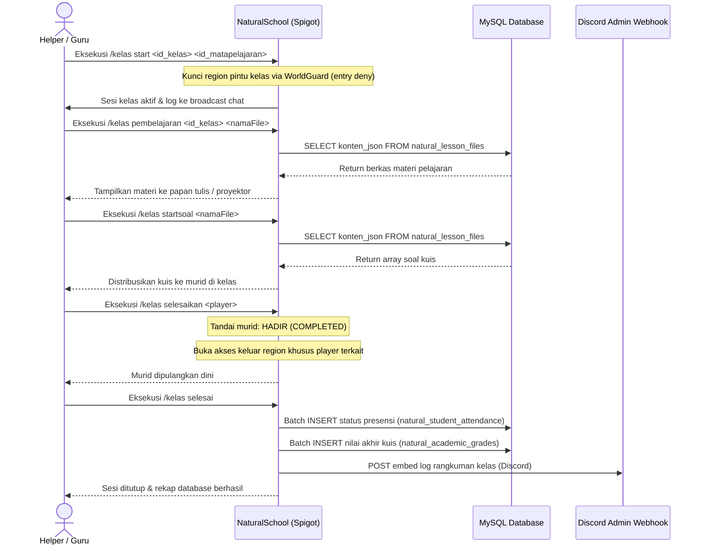
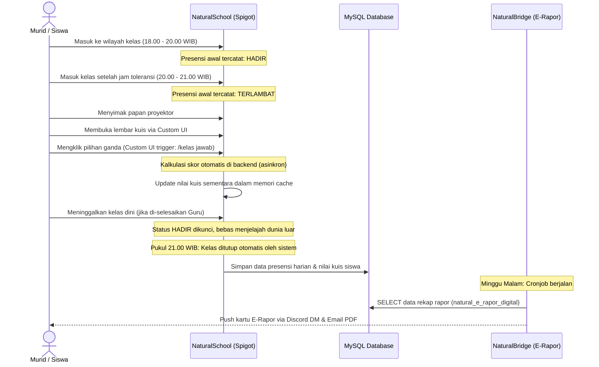

# DOKUMEN MASTER PLAN PENGEMBANGAN EKOSISTEM KOMUNAL NATURALSMP
**Kemitraan Strategis: VoidNode × NaturalSMP**
*Target Eksekusi: Tim Builder, Tim Developer Backend (NaturalSchool, NaturalCore, NaturalBridge, NaturalAuth)*
*Format Berkas: Panduan Implementasi Mutlak (.MD)*

---

## BAB 1: DESAIN ARSITEKTUR SERVER DAN SISTEM AKADEMIK UTAMA

Bab ini menetapkan fondasi dasar manajemen birokrasi, penumpukan hierarki kekuasaan, linimasa progresif pemain, serta logika otomatisasi sistem SKS Hybrid untuk mengendalikan roda perekonomian dan aktivitas inti di NaturalSMP.

### 1.1 Tata Kelola Manajemen dan Hierarki Kepemimpinan Staf

Struktur kepengurusan server dibagi ke dalam tiga lapis otoritas fungsional demi menjamin transparansi, pembagian beban kerja, dan pencegahan penyalahgunaan wewenang (*anti-abuse*):

#### 1.1.1 Otoritas Tertinggi (Server Management)
* **Pemegang Jabatan:** Founder / Owner (Haikal Mabrur & Management).
* **Fungsi Otoritas:** Pemilik mutlak database central, penanggung jawab infrastruktur jaringan proxy (`NaturalVelocity`), pemegang akses utama webstore (`https://store.naturalsmp.net`), serta pengambil keputusan final regulasi makro server.

#### 1.1.2 Manajemen Operasional Sekolah (Staf Admin)
* **Pemegang Jabatan:** Kepala Sekolah & Wakil Kepala Sekolah (Admin / Sr. Staff).
* **Fungsi Otoritas:** Mengawasi performa kerja harian jajaran Helper, mengelola ekosistem Discord dan WhatsApp jembatan komunikasi, melakukan eksekusi perintah pemeliharaan wilayah (*WorldGuard / LuckPerms Management*), serta menyetujui atau membatalkan status dispensasi siswa (`SAKIT` atau `IZIN`) pada dashboard website backend.

#### 1.1.3 Tenaga Pengajar & Fungsional (Staf Helper)
* **Pemegang Jabatan:** Guru Honorer / Guru Piket (Helper Server).
* **Fungsi Otoritas:** Penggerak utama konten harian di dalam game. Memiliki izin mutlak untuk mengeksekusi perintah manajemen kelas terbuka, melakukan rekap absensi, membimbing kuis harian, mendistribusikan Pekerjaan Rumah (PR), serta menertibkan perilaku pemain agar sesuai dengan etika bermasyarakat di wilayah yayasan.

### 1.2 Linimasa Akademik dan Integrasi KSE (Keseimbangan Ekonomi)

NaturalSMP menerapkan sistem penataan waktu dan perkembangan pemain (*progression scaling*) yang ketat agar siklus hidup server berlangsung panjang dan menantang:

#### 1.2.1 Konversi Waktu Dunia Nyata (Real-Life Timeline)
Satu Semester Akademik di dalam game setara dengan **1 Bulan Dunia Nyata (RL)**. Dalam satu semester tersebut, aktivitas harian berjalan secara otomatis di bawah kendali plugin `NaturalSchool` dengan siklus:
* **Minggu 1 & 2:** Fase pembelajaran intensif harian (Kuis dan pengumpulan materi harian).
* **Minggu 3:** Fase pengerjaan Tugas Besar, Pekerjaan Rumah (PR) susulan di Perpustakaan, dan pembukaan masa remedial awal.
* **Minggu 4:** Pelaksanaan Ujian Akhir Tahun (Ujian Kelulusan Jenjang) secara massal, disusul oleh pembagian E-Rapor Tri-Platform pada hari Minggu malam.

#### 1.2.2 Sistem Pembukaan Fitur Berbasis Tingkatan (Tier Progression System)
Pemain dilarang keras mengakses seluruh dimensi atau komoditas tingkat lanjut di hari pertama bergabung. Progresi dikunci berdasarkan Rank Akademik:
* **Murid SD (Tier Dasar):** Terkunci di dunia Overworld dalam radius koordinat terbatas. Fokus pada pengumpulan sumber daya pangan dasar (bertani, beternak) dan menebang kayu umum.
* **Murid SMP (Tier Menengah):** Membuka akses gerbang portal dimensi *Nether*, pemanfaatan sistem ramuan (*Brewing Station*), serta perdagangan instrumen *Iron Tools*.
* **Murid SMA (Tier Elit / End-Game):** Membuka gerbang portal *The End Gate*, menguasai teknologi sihir tingkat lanjut (*Custom Enchanting Table*), perlengkapan *Netherite*, serta izin penerbangan terbatas bagi pemilik rank premium tertentu.

### 1.3 Dinamika Pengelolaan Kelas Terbuka dan SKS Hybrid

Sistem kelas diatur agar berjalan dinamis tanpa memaksa staf atau murid untuk selalu online secara bersamaan secara konvensional:

#### 1.3.1 Aktivasi Kelas Dinamis (Dynamic Class Activation)
Kelas tidak akan aktif jika tidak ada Helper yang berjaga atau murid yang mendaftar. Ketika Guru Honorer mengeksekusi perintah pembukaan, ruang kelas berubah status menjadi *Active Session* yang mengirimkan sinyal data ke seluruh jaringan network server.

#### 1.3.2 Mekanisme Wali Kelas Merangkap (Multi-Class Assignment)
Seorang Staf Helper dapat ditugaskan untuk memegang kendali lebih dari satu sub-kelas atau mata pelajaran secara bersamaan melalui interaksi GUI manajemen guru. Hal ini dilakukan guna menghemat kebutuhan personil staf pada jam sepi (*off-peak hours*).

#### 1.3.3 Sinkronisasi Jam Belajar (SKS Hybrid System)
Murid yang tertinggal pelajaran reguler akibat kesibukan dunia nyata diizinkan mengumpulkan poin SKS secara mandiri melalui pembacaan modul pelajaran digital di Perpustakaan Agung pada jam bebas, memastikan keadilan bagi tipe pemain pekerja atau pelajar di dunia nyata.

### 1.4 Logika Otomatisasi Ujian Kenaikan Kelas dan Keuangan

Ujian kelulusan diatur secara mekanis oleh backend server tanpa campur tangan manusia untuk menjamin objektivitas nilai:

#### 1.4.1 Sinkronisasi GUI Lintas Platform (Crossplay Interface)
Menu lembar pertanyaan ujian ditarik langsung dari database web eksternal dan dirender ke dalam bentuk Chest GUI kustom. GUI ini dirancang responsif, kompatibel untuk dibaca secara jernih baik oleh pemain PC (Java Edition) maupun pemain Mobile/Konsol (Bedrock Edition via Geyser proxy).

#### 1.4.2 Alur Logika Penilaian Instan (Instant Backend Scoring)
Begitu tombol "KUMPULKAN JAWABAN" di dalam GUI diklik oleh pemain, skrip `NaturalSchool` akan langsung mencocokkan input jawaban dengan kunci jawaban di database, melakukan kalkulasi nilai instan, menyuntikkan skor ke riwayat nilai, dan menutup akses GUI agar tidak bisa dieksploitasi ulang.

#### 1.4.3 Kumpulan Bank Soal (Question Pool Randomization)
Untuk mencegah tindakan kecurangan antar-pemain (mencontek), sistem menggunakan algoritma pengacakan soal. Setiap murid yang membuka GUI ujian akan menerima paket kombinasi soal yang berbeda dari total 50 bank soal yang tersedia di database `natural_academic_pool`.

#### 1.4.4 Manajemen Database E-Rapor & Fungsi Penguras Uang (Money Sink)
Murid yang mendapatkan nilai di bawah Standar Kelulusan Minimum (SKM) diwajibkan mengambil remedial. Proses pendaftaran remedial memotong sejumlah Uang Sekolah (In-Game Salary) dalam jumlah besar. Ini berfungsi sebagai mekanisme *Money Sink* utama untuk menjaga laju inflasi mata uang di dalam game agar harga barang di pasar komunal tetap stabil.

### 1.5 Organisasi Siswa Internal Sekolah

#### 1.5.1 Restrukturisasi Fungsi Organisasi MPK & OSIS
* **MPK (Majelis Perwakilan Kelas) ➔ Perwakilan Derajat Angkatan:** Diisi oleh para Ketua Angkatan murid aktif. Berfungsi sebagai penampung aspirasi keluhan pemain mengenai tingkat kesulitan kuis atau regulasi klaim wilayah luar untuk diteruskan kepada Staf Admin.
* **OSIS (Organisasi Siswa Intra Sekolah) ➔ Eksekutif Event Server:** Badan perwakilan murid yang bertugas menggerakkan keramaian server. Setiap akhir pekan, pengurus OSIS merancang event pasar malam ekonomi, turnamen minigames, atau lomba eksterior bangunan dengan anggaran dana hadiah yang disetujui oleh Bendahara Server.

#### 1.5.2 Kualifikasi Berbasis Waktu Bermain (Playtime Filtering)
Untuk menghindari kepengurusan yang tidak aktif (*inactive leadership*), pencalonan anggota MPK/OSIS disaring ketat secara otomatis oleh database `NaturalCore`:
* **Batas Minimal (3 Hari / 72 Jam RL Online Time):** Syarat mutlak pendaftaran agar posisi diisi oleh pemain yang sudah memahami seluk-beluk komunitas server.
* **Batas Maksimal (30 Hari RL Online Time):** Batas atas khusus untuk posisi Ketua umum, memastikan kepemimpinan dipegang oleh pemain aktif fase pertengahan (*mid-game*) demi mendorong regenerasi kepemimpinan, sementara pemain *end-game* yang super aktif diarahkan menjadi staf fungsional/helper.

---

## BAB 2: ARSITEKTUR KOMPLEKS YAYASAN TERINTEGRASI DAN TATA RUANG SPASIAL

Bab ini menyediakan panduan spesifikasi spasial, tata letak arsitektur, cetak biru *non-player character* (NPC), serta seluruh infrastruktur fisik di dalam area aman Yayasan Natural sebagai panduan mutlak Tim Builder.

### 2.1 Struktur Arsitektur dan Pola Tata Ruang Gedung Kelas

Setiap jenjang pendidikan memiliki karakteristik struktural dan pola bangunan yang khas untuk mencerminkan perkembangan progresi pemain secara visual:

#### 2.1.1 Gedung SD (Klaster Dasar)
* **Pola Arsitektur:** Berbentuk huruf **"U" Terbuka** menghadap langsung ke arah Plaza Utama. Desain bangunan terdiri atas 2 tingkat.
* **Material Utama:** *Oak Wood*, *Stripped Wood*, dan *Stone Bricks* cerah dengan aksen tambahan *Lime* atau *Yellow Concrete*.
* **Tata Letak Ruangan:**
  * **Lantai 1:** Diisi oleh Kelas 1, Kelas 2, Kelas 3, dan Ruang Guru SD. Koridor tengah lantai 1 menyediakan Zona AFK berkode `#AFK_SD-1`.
  * **Lantai 2:** Diisi oleh Kelas 4, Kelas 5, Kelas 6, dan Ruang Aula Ujian Kelulusan SD.
* **Aset Estetik:** Papan tulis menggunakan material *Blackstone*, meja murid memanfaatkan tangga (*Stairs*) terbalik, serta jendela kaca besar untuk memberikan kesan ramah lingkungan.

#### 2.1.2 Gedung SMP (Klaster Menengah)
* **Pola Arsitektur:** Simetris Linier Berkoridor Ganda (Pola **"H"**). Desain bangunan terdiri atas 2 tingkat dilengkapi dengan balkon terbuka di area luar lantai dua.
* **Material Utama:** *Spruce Wood*, *Deepslate Tile*, dengan aksen warna *Light Blue Concrete*.
* **Tata Letak Ruangan:**
  * **Lantai 1:** Mencakup Kelas 7, Kelas 8, Ruang Tata Usaha (TU) SMP, dan Zona AFK berkode `#AFK_SMP-1`.
  * **Lantai 2:** Mencakup Kelas 9, Laboratorium Kimia (area pembuatan ramuan/*brewing*), dan Ruang Ujian Kelulusan SMP.

#### 2.1.3 Gedung SMA (Klaster Elit / End-Game)
* **Pola Arsitektur:** **Kastel Universitas Klasik Gothic (Pola Kotak Tertutup dengan Courtyard atau taman terbuka di bagian tengah)**. Desain bangunan terdiri atas 3 tingkat dengan Menara Jam tinggi sebagai ikon utama.
* **Material Utama:** *Quartz*, *Nether Bricks*, *Dark Oak Wood*, dengan aksen mewah berupa *Red Concrete* or *Gold Block*.
* **Tata Letak Ruangan:**
  * **Lantai 1:** Mencakup Kelas 10, Ruang OSIS Inti, dan Zona AFK berkode `#AFK_SMA-1`.
  * **Lantai 2:** Mencakup Kelas 11, Laboratorium Sihir (*Custom Enchanting Area*), dan Ruang Guru SMA.
  * **Lantai 3 (Menara):** Menjadi area Kelas 12, Ruang Rapat MPK, dan Ruang Portal Ujian Akhir (*The End Gate*).

#### 2.1.4 Perpustakaan Agung Yayasan (The Grand Library)
* **Posisi Strategis Peta:** Terletak tepat di ujung belakang Plaza Utama, berada pada poros tengah kompleks yayasan. Bangunan ini menjulang tinggi di antara ketiga klaster gedung sekolah sebagai pusat ilmu pengetahuan.
* **Desain Interior:** Bergaya katedral klasik dengan atap kubah kaca transparan (*skylight*), jajaran rak buku raksasa setinggi 4 hingga 5 blok, tangga kayu melingkar, dan hamparan karpet merah panjang di sepanjang koridor utama.
* **Konten Interaktif:** Rak buku interaktif yang dapat diklik kanan untuk mendapatkan *Written Book* panduan lore, bilik-bilik meja belajar mandiri bersekat, dan papan pengumuman pengumpulan tugas mingguan sistem SKS Hybrid.

#### 2.1.5 Kompleks Gedung Ekstrakurikuler & Pusat Bakat
* **Pola Arsitektur:** Gedung olahraga dan seni bergaya modern kontemporer yang terletak di antara gedung SMP dan SMA. Memiliki kubah besar dan dinding kaca melingkar.
* **Hubungan dengan Gameplay:** Tempat menampung fasilitas latihan fisik, studio seni, atau arena uji ketangkasan. Bangunan ini memiliki ruang fungsional seperti Ruang Gym & Latihan Fisik tempat berdirinya NPC Pelatih Khusus penyedia quest tantangan fisik (seperti parkour bawah tanah sekolah) untuk meningkatkan kapasitas status karakter secara permanen.

#### 2.1.6 Dermaga Pemancingan Relaksasi Siswa (Plaza Fishing Dock)
* **Posisi Spasial:** Terletak tepat di area luar (sebelah) Air Mancur Plaza Tengah, memanfaatkan aliran air buatan yang didesain mengelilingi pusat Social Hub.
* **Tujuan Arsitektur & Gameplay:** Dirancang sebagai fasilitas ekonomi-relaksasi aktif bagi pemain yang berada di zona AFK. Builder wajib membangun dermaga kayu estetis menggunakan material *Dark Oak Slabs* lengkap dengan dekorasi jala ikan, tong kayu, dan jembatan kecil. Murid dapat memancing di sini sembari menunggu jam operasional kelas untuk mendapatkan item roleplay kustom, ikan konsumsi, atau sampah kuno yang bernilai tinggi jika dijual kembali ke koperasi.

### 2.2 Daftar Spesifikasi dan Penempatan NPC Terintegrasi

| ID NPC | Nama Resmi NPC | Lokasi Build | Fungsi Mekanis (Gameplay) | Catatan Visual (Skin) |
| :--- | :--- | :--- | :--- | :--- |
| `NPC_REGIST_01` | Pak Haris (Panitia MOS) | Aula Pendaftaran / Spawn | Memicu GUI pendaftaran murid baru, memberikan NIS dan starter pack buku panduan. | Setelan jas formal rapi lengkap dengan kacamata. |
| `NPC_SATPAM_01` | Pak Joko (Keamanan) | Gerbang Utama Kompleks | Menyediakan informasi regulasi server dan fitur teleportasi darurat jika pemain tersesat. | Seragam lengkap Satpam Indonesia dengan atribut topi baja/pet. |
| `NPC_PUSTAKA_01` | Ibu Sofia (Pustakawan) | Meja Depan Perpustakaan | Mengatur sistem peminjaman buku tugas atau penukaran quest item buku kuno. | Wanita paruh baya, rambut disanggul rapi, memegang sebuah buku. |
| `NPC_INFO_01` | Pak Bambang (Arsiparis) | Sudut Dalam Perpustakaan | Membuka akses informasi kurikulum akademik, jadwal ujian nasional, dan biaya remedial. | Pria tua bijaksana berpakaian kemeja batik tradisional. |
| `NPC_KANTIN_01` | Mbak Sri (Warung Makan) | Kios Utama Kantin Pusat | Admin Shop dasar untuk kebutuhan konsumsi makanan (roti, steak, wortel). | Memakai baju celemek memasak (*apron*) kain. |
| `NPC_KANTIN_02` | Mas Anto (Pengepul) | Sudut Kantin Pusat | Admin Shop penampungan tempat menjual hasil tani atau hasil tambang mentah. | Model pakaian petani tradisional atau pedagang pasar bumi. |
| `NPC_OSIS_01` | Ketua OSIS (Event Tracker) | Panggung Event Plaza | Menyediakan info quest mingguan OSIS dan tempat klaim reward pemenang event. | Karakter remaja mengenakan jas almamater sekolah kebanggaan. |
| `NPC_EXAM_SD` | Pengawas Ujian SD | Ruang Ujian Gedung SD | Memicu menu GUI lembar pertanyaan kelulusan jenjang SD. | Pakaian guru dinas rapi formal. |
| `NPC_EXAM_SMP` | Pengawas Ujian SMP | Ruang Ujian Gedung SMP | Memicu menu GUI lembar pertanyaan kelulusan jenjang SMP. | Pakaian guru dinas rapi formal. |

### 2.3 Cetak Biru Komponen Social Hub Yayasan Natural

Plaza tengah dirancang sebagai inti dari seluruh aktivitas sosial dan ekonomi server komunal:

#### 2.3.1 Sistem Zona AFK Berperingkat (Integrated AFK Pools)
Zona AFK ditempatkan pada titik regional strategis sekolah dengan pembagian reward bertingkat:
* `#AFK_GLOBAL-MAIN` (Air Mancur Plaza Tengah): Terbuka untuk Umum. Multiplier EXP dan Uang sekolah standar (*base rate*) per 10 menit.
* `#AFK_SD-1` (Lobi Istirahat Gedung SD): Hanya Rank Murid SD. Tambahan uang saku berkala yang disesuaikan untuk ekonomi pemula.
* `#AFK_SMP-1` (Taman Dalam Gedung SMP): Hanya Rank Murid SMP. Pemberian material crafting tingkat menengah acak (Iron/Coal shards).
* `#AFK_SMA-1` (VIP Lounge Courtyard SMA): Hanya Rank Murid SMA. Pemberian token khusus atau pecahan kosmetik/enchantment shards tingkat lanjut.

#### 2.3.2 Atmosfer Audio Sekolah (BGM Regional)
Memanfaatkan kerja integrasi plugin audio berbasis WorldGuard region flags untuk memperkuat imersi visual: Plaza Utama memainkan musik instrumen mars sekolah ceria, Perpustakaan Agung memainkan instrumen musik Lofi sunyi, dan Gedung SMA memainkan musik orkestra klasik gothic yang megah.

#### 2.3.3 Koperasi Sekolah (Gacha Crates Station)
Didesain menyerupai bangunan Koperasi Sekolah modern di sisi Plaza Utama, berisi jajaran Ender Chest kustom sebagai stasiun pembukaan peti (Peti Persediaan SD, Peti Beasiswa SMP, Peti Prestasi SMA, Peti OSIS).

#### 2.3.4 Kaveling Kios ChestShop & Bursa Saham Siswa
Area pasar diatur secara fisik di dalam Kantin Pusat berupa penyewaan 10-15 petak tanah kosong ukuran 3x3 bagi murid tingkat lanjut untuk membuka toko dagang mandiri, serta papan mading interaktif yang memicu pembukaan command lelang `/ah`.

#### 2.3.5 Premium Store Terminal & Paid Rank Preview Station
Paviliun semi-modern beratap kaca di sudut Plaza Utama untuk penukaran **Natural Coin** (`https://store.naturalsmp.net`). Bersebelahan dengan Altar Almamater Premium berisi 10 manekin kustom ber-pelat tekan kustom (*Weighted Pressure Plate*) untuk melihat pratinjau hak istimewa rank premium via Custom GUI khusus.

---

## BAB 3: INTEGRASI LUCKPERMS DAN ATRIBUT FUNGSIONAL PREMIUM (VIRTUAL MECHANICS)

Bab ini mengatur seluruh logika virtual, mekanis *perks*, fungsionalitas ekonomi premium melalui integrasi toko web, serta detail keuntungan fungsional dari **10 Paid Ranks** yang dikendalikan secara absolut menggunakan engine **LuckPerms**.

### 3.1 Sistem Jembatan LuckPerms & Kebijakan Natural Coin

Seluruh manajemen hak perizinan pemain menggunakan database terpusat plugin **LuckPerms**. Ketika skrip backend `NaturalBridge` mendeteksi adanya transaksi pembelian sukses di website `https://store.naturalsmp.net`, konsol server game akan mengeksekusi perintah sinkronisasi otomatis:

```

```text
File Master_Plan_NaturalSMP_Bab_1_5_Final.md successfully generated.

```bash
/lp user <player> parent add <nama_group_rank>

```

Sistem grup dikonfigurasi secara hierarkis berjenjang (*Inheritance System*), di mana rank yang lebih tinggi otomatis mendapatkan hak perintah dari rank di bawahnya secara mutlak.

### 3.2 Spesifikasi Detail Perizinan, Hak Istimewa, & Perks Teritori 10 Paid Ranks

Untuk mendongkrak nilai jual paket donasi (*value proposition*), pembagian kuota perintah utilitas, batas rumah (`/sethome`), batas lelang (`/ah`), serta kuota proteksi wilayah Land Claim (**Kavling Kosan Siswa**) dan faksi (**Klub Ekstrakurikuler/Geng Sekolah**) diatur dengan skema berikut:

#### 3.2.1 Tier 1: [MIDI]

* **LuckPerms Group Name:** `midi` | **Chat Box Prefix:** `&8[&7MIDI&8]&f` (Abu-abu Bersih)
* **Spesifikasi Permissions Nodes & Perks:**
* `essentials.sethome.max.3` (Maksimal 3 titik home koordinat)
* `auctionhouse.sell.max.3` (Maksimal 3 item di bursa lelang bersamaan)
* `essentials.hat` (Akses memakai blok kosmetik di kepala via perintah `/hat`)
* `naturalcore.command.condense` (Mengubah otomatis tumpukan ingot menjadi bentuk blok padat)
* `landclaim.limit.max.2` (Maksimal memiliki 2 lokasi Kavling Kosan Siswa)
* `landclaim.blocks.bonus.1500` (Bonus awal 1.500 balok proteksi wilayah)


#### 3.2.2 Tier 2: [VIP]

* **LuckPerms Group Name:** `vip` (Mewarisi grup `midi`) | **Chat Box Prefix:** `&a[&2VIP&a]&f` (Hijau Daun Muda)
* **Spesifikasi Permissions Nodes & Perks:**
* `essentials.sethome.max.5` | `auctionhouse.sell.max.5`
* `essentials.workbench` atau `essentials.wb` (Membuka Meja Kerja Crafting portabel di mana saja)
* `essentials.trash` (Membuka menu Tempat Sampah Virtual instan via `/trash`)
* `landclaim.limit.max.3` (Maksimal memiliki 3 lokasi Kavling Kosan Siswa)
* `landclaim.blocks.bonus.3000` (Bonus perluasan wilayah sebanyak 3.000 balok)


#### 3.2.3 Tier 3: [VIP+]

* **LuckPerms Group Name:** `vip_plus` (Mewarisi grup `vip`) | **Chat Box Prefix:** `&3[&bVIP+&3]&f` (Cyan Toska Magis)
* **Spesifikasi Permissions Nodes & Perks:**
* `essentials.sethome.max.7` | `auctionhouse.sell.max.6`
* `essentials.enderchest` atau `essentials.ec` (Membuka Peti Ender portabel secara instan untuk mengamankan barang)
* `landclaim.limit.max.4` (Maksimal memiliki 4 lokasi Kavling Kosan Siswa)
* `landclaim.blocks.bonus.5000` (Bonus perluasan wilayah sebanyak 5.000 balok)
* `naturalschool.discount.remedial.5` (Sinkronisasi database memberikan diskon biaya remedial ujian sebesar 5%)


#### 3.2.4 Tier 4: [MVP]

* **LuckPerms Group Name:** `mvp` (Mewarisi grup `vip_plus`) | **Chat Box Prefix:** `&b[&3MVP&b]` (Biru Langit Cerah)
* **Spesifikasi Permissions Nodes & Perks:**
* `essentials.sethome.max.10` | `auctionhouse.sell.max.8`
* `essentials.feed` (Mengisi bar lapar makanan karakter secara instan. Cooldown: 10 Menit)
* `landclaim.limit.max.5` (Maksimal memiliki 5 lokasi Kavling Kosan Siswa)
* `landclaim.blocks.bonus.8000` (Bonus perluasan wilayah sebanyak 8.000 balok)
* `naturalkantin.priority.chestshop` (Mendapatkan hak prioritas otomatis/antrean utama penyewaan kios dagang kantin)


#### 3.2.5 Tier 5: [MVP+]

* **LuckPerms Group Name:** `mvp_plus` (Mewarisi grup `mvp`) | **Chat Box Prefix:** `&9[&1MVP+&9]&f` (Biru Safir Tua)
* **Spesifikasi Permissions Nodes & Perks:**
* `essentials.sethome.max.15` | `auctionhouse.sell.max.10`
* `essentials.feed.cooldown.300` (Waktu tunggu perintah `/feed` dipangkas menjadi hanya 5 menit)
* `essentials.near` (Melihat daftar jarak pemain lain di dunia survival luar untuk mengantisipasi serangan)
* `supertrails.common.allow` (Membuka kategori efek partikel berjalan dasar seperti debu asap atau sparkles)
* `landclaim.limit.max.7` (Maksimal memiliki 7 lokasi Kavling Kosan Siswa)
* `landclaim.blocks.bonus.12000` (Bonus perluasan wilayah sebanyak 12.000 balok)


#### 3.2.6 Tier 6: [GOLD]

* **LuckPerms Group Name:** `gold` (Mewarisi grup `mvp_plus`) | **Chat Box Prefix:** `&e&l[&6&lGOLD&e&l]&f` (Emas Menyala Bold)
* **Spesifikasi Permissions Nodes & Perks:**
* `essentials.sethome.max.20` | `auctionhouse.sell.max.12`
* `essentials.heal` (Memulihkan bar darah penuh secara instan. Cooldown: 15 Menit. Otomatis terkunci jika berada dalam Combat Tag PvP)
* `naturalschool.discount.remedial.10` (Potongan biaya remedial naik menjadi 10% di database)
* `worldguard.region.bypass.afk_smp_1` (Bypass otoritas akademik, bebas masuk ruang AFK eksklusif SMP kapan saja)
* `landclaim.limit.max.10` (Maksimal memiliki 10 lokasi Kavling Kosan Siswa)
* `landclaim.blocks.bonus.20000` (Bonus perluasan wilayah sebanyak 20.000 balok)


#### 3.2.7 Tier 7: [NATURE]

* **LuckPerms Group Name:** `nature` (Mewarisi grup `gold`) | **Chat Box Prefix:** `&a&l[&2&lNATURE&a&l]&f` (Hijau Zamrud Khas)
* **Spesifikasi Permissions Nodes & Perks:**
* `essentials.sethome.max.30` | `auctionhouse.sell.max.15`
* `essentials.feed.cooldown.0` (Perintah `/feed` berubah menjadi tanpa batas waktu / makanan tidak terbatas selamanya)
* `essentials.nick` (Akses perintah mengubah nama panggilan chatbox kustom, menyaring kata kasar otomatis)
* `supertrails.nature.allow` (Membuka efek partikel berjalan eksklusif bertema alam hijau zamrud)
* `landclaim.limit.max.15` (Maksimal memiliki 15 lokasi Kavling Kosan Siswa)
* `landclaim.blocks.bonus.35000` (Bonus perluasan wilayah sebanyak 35000 balok)


#### 3.2.8 Tier 8: [NATURE+]

* **LuckPerms Group Name:** `nature_plus` (Mewarisi grup `nature`) | **Chat Box Prefix:** `&b&l[&a&lNATURE+&b&l]&f` (Gradasi Neon Magis)
* **Spesifikasi Permissions Nodes & Perks:**
* `essentials.sethome.max.40` | `auctionhouse.sell.max.20`
* `essentials.teleport.cooldown.0` (*No Teleport Delay* / Eksekusi perintah `/home` atau `/tpa` instan tanpa jeda tunggu diam 3 detik)
* `naturalafk.multiplier.15` (Multiplier ekonomi, mendapatkan bonus +15% Saldo Uang Sekolah saat berdiam di zona AFK)
* `landclaim.limit.max.20` (Maksimal memiliki 20 lokasi Kavling Kosan Siswa)
* `landclaim.blocks.bonus.50000` (Bonus perluasan wilayah sebanyak 50.000 balok)


#### 3.2.9 Tier 9: [CAKRAWALA]

* **LuckPerms Group Name:** `cakrawala` (Mewarisi grup `nature_plus`) | **Chat Box Prefix:** Gradasi Iridium Teks Bergerak Hex Purplish-Magenta: `[CAKRAWALA]`
* **Spesifikasi Permissions Nodes & Perks:**
* `essentials.sethome.max.60` | `auctionhouse.sell.max.25`
* `essentials.fly` (Akses terbang bebas. *Regulasi ketat:* Hanya aktif di dalam area Safe Zone kompleks yayasan sekolah dan area batas koordinat Land Claim pribadi).
* `worldguard.region.bypass.afk_sma_1` (Akses bebas masuk ke VIP Lounge SMA secara permanen)
* `landclaim.limit.max.30` (Maksimal memiliki 30 lokasi Kavling Kosan Siswa)
* `landclaim.blocks.bonus.80000` (Bonus perluasan wilayah sebanyak 80.000 balok)


#### 3.2.10 Tier 10: [INVESTOR]

* **LuckPerms Group Name:** `investor` (Mewarisi seluruh grup dari tier 1-9) | **Chat Box Prefix:** Teks Beranimasi Pelangi Bergerak Bergelombang: `[INVESTOR]`
* **Spesifikasi Permissions Nodes & Perks:**
* `essentials.sethome.max.unlimited` (Batas penyimpanan titik koordinat home tidak terbatas)
* `auctionhouse.sell.max.40` (Maksimal menjual 40 item sekaligus di bursa lelang)
* `essentials.heal.cooldown.300` (Waktu tunggu perintah `/heal` dipangkas ekstrem menjadi hanya 5 menit)
* `essentials.fly.wilderness.allow` (Izin terbang `/fly` aktif penuh di area luar eksplorasi survival, otomatis mati selama 3 menit jika terkena status Combat Tag pertempuran)
* `naturalschool.discount.remedial.25` (Hak pemilik modal komite sekolah, mendapatkan diskon biaya remedial ujian ekstrem sebesar 25%)
* `naturalbridge.cron.monthly.keydividen` (Sistem backend otomatis menyuntikkan dana dividen bulanan setiap tanggal 1 berupa: 2x Kunci Peti OSIS dan 1x Kunci Premium Crate gratis ke inventaris)
* `landclaim.limit.max.unlimited` (Batas jumlah lokasi Kavling Kosan Siswa tidak terbatas)
* `landclaim.blocks.bonus.150000` (Bonus perluasan wilayah raksasa sebanyak 150.000 balok proteksi)


### 3.3 Katalog Tambahan Premium Store & Atribut Karakter Sekunder

Di area Premium Store Terminal, koin premium hasil top-up dari webstore resmi bisa ditukarkan secara satuan untuk peningkatan status permanen (*Atribut Scaling*) dengan batasan ketat (*hard-capped*):

* **Token Atribut `+1 Heal` (Instant Recovery Cooldown System):** Setiap level upgrade memotong waktu tunggu pemulihan regenerasi darah alami karakter (*Saturation Regen Rate*) sebesar 5% di luar sekolah (Maksimal Level 5 / 25% Reduction).
* **Token Atribut `Extra Heart Shard`:** Memberikan penambahan slot kapasitas maksimal bar kesehatan di luar batas standar Minecraft bawaan (Maksimal pembelian 4 Shards / Setara 2 ekstra jantung penuh).

### 3.4 Mekanisme Kerja Custom GUI Preview Station

Menghapus sistem obrolan teks konvensional, pemicu mekanis di area Paid Rank Preview Station diatur dengan alur teknis berikut:

1. Pemain berdiri di atas pelat tekan kustom di depan manekin Donasi premium ➔ Sistem mendeteksi koordinat pelat ➔ Mengirimkan perintah backend: `/ui open rank_preview_<nama_rank> <player_name>`.
2. Layar pemain memunculkan wadah **Chest GUI / Custom UI Kustom** bertekstur indah terintegrasi *Resource Pack* server yang merender visualisasi keuntungan, spesifikasi *permissions node*, kuota kosan, dan batas lelang.
3. Di dalam GUI terpasang item tombol besar **"KLIK DI SINI UNTUK MEMBELI"**. Jika murid mengklik kanan tombol tersebut, server Minecraft mengirimkan tautan konfirmasi aman yang otomatis membuka jendela web browser pemain menuju URL target transaksi: `https://store.naturalsmp.net`.

---

## BAB 4: LOGIKA AKADEMIK 1-KLIK & DATABASE MANAJEMEN KESISWAAN INTERAKTIF (BACKEND GURU)

Bab ini mengatur arsitektur backend, hak akses pengajaran staf (Helper / Guru Honorer), manajemen ketertiban waktu nyata (WIB), serta perintah ringkas otomatisasi kompilasi nilai kesiswaan.

### 4.1 Skema Jadwal Operasional Kelas Terstruktur (WIB Fixed Time)

Untuk memastikan keseimbangan hidup riil para pemain, siklus jam operasional sekolah utama berjalan kaku menggunakan patokan zona waktu dunia nyata (WIB) pada malam hari:

* **Pukul 18.00 WIB (Pintu Kelas Terbuka & Sesi Dimulai):** Helper memasuki ruangan kelas kustom dan mengeksekusi perintah `/kelas start <id_matapelajaran>`. Sistem WorldGuard otomatis mengunci akses wilayah pintu masuk kelas secara fisik. Hanya murid dengan angkatan jenjang terkait yang diizinkan masuk dan duduk di kursi tangga terbalik.
* **Pukul 20.00 WIB (Batas Toleransi Mengunci):** Pintu absensi ditutup oleh sistem otomatis `NaturalSchool`. Murid baru yang melewati batas pintu kelas atau baru melakukan login ke server di atas jam ini akan otomatis dijatuhi status kehadiran permanent berkode **`TERLAMBAT`** pada database record harian.
* **Pukul 21.00 WIB (Kelas Selesai & Pembubaran):** Sesi pengajaran resmi ditutup secara global. Pemain yang tercatat online di server game namun tidak berada di dalam wilayah kelas dari rentang waktu 18.00 - 20.00 WIB akan langsung dijatuhi hukuman otomatis berkode **`ALFA`** (Membolos).

### 4.2 Arsitektur Sistem Perintah (Command Structure)

Sistem akademik NaturalSchool membagi fungsionalitas perintah menjadi 3 kategori utama yang bersih dan terstruktur untuk menjaga pemisahan wewenang serta kenyamanan pengguna:

#### 1. Perintah Admin (`/naturalschool`)
* **Base Command:** `/naturalschool` (Alias: `/nschool`, `/ns`)
* **Fungsi:** Digunakan oleh Administrator untuk manajemen konfigurasi, reload plugin, pemaksaan status sakelar ujian global, dan penanganan visual dialog debug.

#### 2. Perintah Portal Siswa Universal (`/school` / `/sekolah`)
* **Base Command:** `/school` (Alias: `/sekolah`)
* **Fungsi:** Digunakan secara universal/global oleh siswa untuk mengakses menu portal akademik umum (tidak terikat region/kelas tertentu).
* **Format Subcommand:**
  * **Inggris:** `/school exam` (Ujian), `/school info` (Profil), `/school report` (Rapor).
  * **Indonesia:** `/sekolah ujian` (Ujian), `/sekolah info` (Profil), `/sekolah rapor` (Rapor).

#### 3. Perintah Kegiatan Kelas Regional (`/class` / `/kelas`)
* **Base Command:** `/class` (Alias: `/kelas`, `/k`)
* **Fungsi:** Digunakan oleh Guru/Helper dan Murid khusus untuk interaksi belajar-mengajar di dalam sesi kelas aktif (bersifat spasial/regional, mendeteksi wilayah secara otomatis).
* **Format Subcommand (Guru):** `start`, `selesai` / `finish`, `pembelajaran` / `lesson`, `startsoal` / `startquiz`, `selesaikan` / `dismiss`, `rekap` / `compile`, `pertanyaan` / `questions`, `jawab` / `answer`, `chat-rekap`.
* **Format Subcommand (Murid):** `tanya` / `ask`.

> **Prinsip Auto-Detect Region:** Seluruh perintah kegiatan kelas (`/class` / `/kelas`) **tidak memerlukan `<id_kelas>` sebagai argumen**. Plugin secara otomatis mendeteksi region WorldGuard tempat Guru/Siswa berdiri saat ini (misal: region `kelas8`) menggunakan API WorldGuard. Jika Guru/Siswa tidak berada di dalam region kelas manapun saat menjalankan command, sistem menampilkan pesan error: `§cKamu tidak berada di dalam region kelas manapun!`

Helper memiliki dua perintah utama yang **harus dijalankan secara manual** sebelum sesi kelas dimulai, yaitu memuat materi proyektor dan memuat soal kuis. File sumber kedua perintah ini disiapkan terlebih dahulu oleh Helper melalui **dashboard website** dan disimpan di sistem database pusat.

#### 4.2.1 Perintah Memuat Materi Pembelajaran (`/kelas pembelajaran <namaFile>`)

* **Fungsi:** Menampilkan materi pelajaran pada proyektor/papan informasi virtual di dalam ruang kelas (berbasis Armor Stand display atau ItemFrame kustom).
* **Format Perintah:** `/kelas pembelajaran matematika_aljabar_v2`
* **Mekanisme:** Plugin mendeteksi region kelas Guru secara otomatis, lalu mengambil file konten dengan nama `matematika_aljabar_v2` dari tabel `natural_lesson_files` di database, dan me-render teksnya ke display proyektor kelas tersebut.
* **Catatan:** File materi **harus dibuat terlebih dahulu** oleh Helper melalui panel website sebelum perintah ini bisa dieksekusi. Satu file dapat dipakai ulang di sesi berikutnya.

#### 4.2.2 Perintah Memulai Soal Kuis (`/kelas startsoal <namaFile>`)

* **Fungsi:** Membuka dan mendistribusikan soal kuis kepada seluruh murid yang hadir di kelas secara serentak melalui **Custom UI** bespoke NaturalSchool.
* **Format Perintah:** `/kelas startsoal matematika_kuis_minggu3`
* **Mekanisme:** Plugin mendeteksi region kelas Guru secara otomatis, mengambil paket soal dari database, mengacak urutan soal, lalu mengirimkannya ke Custom UI masing-masing murid. Jawaban dikirim balik secara asinkron ke backend untuk dinilai otomatis.
* **Catatan Penting:** Antarmuka soal kuis menggunakan **Custom UI bespoke** (bukan Chest GUI standar). Spesifikasi teknis Custom UI akan didokumentasikan terpisah di dokumen `SPEC_NaturalSchool_UI.md`.

#### 4.2.3 Perintah Pemulangan Dini (`/kelas selesaikan <player>`)

* **Mekanisme Kerja:** Jika seorang murid telah berhasil merampungkan kuis, menyimak materi proyektor, atau merampungkan praktik belajar sebelum pukul 21.00 WIB, Guru berhak mengeksekusi perintah ini.
* **Dampak Mekanis:** Status kehadiran murid tersebut langsung dikunci di database server sebagai `HADIR (COMPLETED)`. Wilayah pintu kelas akan terbuka khusus untuk karakter tersebut, mengizinkannya melompat keluar kompleks sekolah untuk melakukan grinding survival luar atau log-out dari game dengan aman tanpa takut kehilangan poin presensi harian.

#### 4.2.4 Sistem Pekerjaan Rumah (PR System) & Akses Perpustakaan

Guru dapat memberikan tugas Pekerjaan Rumah (PR) tambahan melalui dashboard web. Fitur ini menjadi penyelamat bagi murid yang terpaksa pulang dini atau murid yang tidak hadir sama sekali karena urusan real-life (`ALFA`, `SAKIT`, `IZIN`).

* Murid dapat mengerjakan PR ini kapan saja di luar jam operasional utama dengan mendatangi Perpustakaan Agung pada jam bebas, berinteraksi dengan buku digital, dan mengumpulkan lembar jawaban kuis mandiri.
* Penyelesaian tugas PR yang valid akan memicu eksekusi query SQL otomatis untuk menganulir rekap catatan poin `ALFA` mereka pada database mingguan sebelum hari kelulusan akhir pekan tiba.

### 4.3 Logika Rekapitulasi Nilai Otomatis 1-Klik (`/kelas rekap`)

Untuk mencegah fenomena kelelahan pengurus akibat mencatat data ratusan siswa secara manual, Helper dibekali perintah otomatisasi cerdas. Kelas-id **tidak perlu ditulis** — sistem mendeteksi region secara otomatis:

```bash
/kelas rekap
```

**Alur Eksekusi Skrip Backend:**

1. Sistem melakukan pemindaian (*scanning*) kilat terhadap data nilai sementara yang tersimpan pada cache memori server dari pengerjaan kuis GUI para murid di sesi tersebut.
2. Skrip backend secara asinkron langsung melakukan *push data* massal, mengelompokkan nilai, menyuntikkan angka ke tabel `natural_academic_grades`, dan memperbarui status ketidakhadiran di tabel `natural_student_attendance`.
3. Mengirimkan sinyal otomatis ke API `NaturalBridge` untuk langsung mencetak dokumen E-Rapor Digital secara riil ke platform eksternal.

### 4.4 Struktur Tabel Database Kesiswaan Utama (MySQL DDL Blueprint)

Developer wajib membangun arsitektur tabel database terpusat berikut pada backend sistem:

```sql
-- 1. TABEL PENCATATAN PRESENSI SEKOLAH HARIAN
CREATE TABLE natural_student_attendance (
    id_log INT AUTO_INCREMENT PRIMARY KEY,
    player_uuid VARCHAR(36) NOT NULL,
    player_name VARCHAR(16) NOT NULL,
    id_kelas VARCHAR(10) NOT NULL,         -- Format ID: SD_01, SMP_07, SMA_11
    id_helper VARCHAR(36) NOT NULL,        -- UUID Helper pengajar sesi terkait
    mata_pelajaran VARCHAR(32) NOT NULL,
    status_kehadiran ENUM('HADIR', 'TERLAMBAT', 'ALFA', 'IZIN', 'SAKIT') NOT NULL,
    waktu_record TIMESTAMP DEFAULT CURRENT_TIMESTAMP,
    INDEX (player_uuid),
    INDEX (status_kehadiran)
) ENGINE=InnoDB DEFAULT CHARSET=utf8mb4;

-- 2. TABEL AKUMULASI NILAI AKADEMIK & TUGAS PR
CREATE TABLE natural_academic_grades (
    id_nilai INT AUTO_INCREMENT PRIMARY KEY,
    player_uuid VARCHAR(36) NOT NULL,
    jenjang ENUM('SD', 'SMP', 'SMA') NOT NULL,
    mata_pelajaran VARCHAR(32) NOT NULL,
    nilai_angka TINYINT UNSIGNED NOT NULL,  -- Range Angka 0 s.d 100
    tipe_ujian ENUM('HARIAN', 'AKHIR_TAHUN', 'PR_PERPUSTAKAAN', 'REMEDIAL') NOT NULL,
    jumlah_remedial_diambil TINYINT DEFAULT 0,
    alasan_nilai TEXT DEFAULT NULL,        -- Diisi 'NILAI_88_GURU_ABSEN' jika Helper tidak siapkan file
    waktu_input TIMESTAMP DEFAULT CURRENT_TIMESTAMP,
    UNIQUE KEY unique_student_subject (player_uuid, mata_pelajaran, tipe_ujian),
    INDEX (player_uuid)
) ENGINE=InnoDB DEFAULT CHARSET=utf8mb4;

-- 3. TABEL RANGKUMAN PENCETAKAN RAPOR AKHIR SEMESTER
CREATE TABLE natural_e_rapor_digital (
    id_rapor INT AUTO_INCREMENT PRIMARY KEY,
    player_uuid VARCHAR(36) NOT NULL,
    nomor_induk_siswa VARCHAR(12) NOT NULL UNIQUE,
    tahun_ajaran_rl VARCHAR(10) NOT NULL,    -- Format: 2026-A, 2026-B
    jenjang_terakhir ENUM('SD', 'SMP', 'SMA') NOT NULL,
    total_hadir SMALLINT DEFAULT 0,
    total_terlambat SMALLINT DEFAULT 0,
    total_alfa SMALLINT DEFAULT 0,
    total_izin_sakit SMALLINT DEFAULT 0,
    nilai_rata_rata_kolektif DECIMAL(5,2) NOT NULL,
    status_kelulusan ENUM('LULUS', 'TINGGAL_KELAS', 'PROSES') DEFAULT 'PROSES',
    catatan_wali_kelas TEXT,
    waktu_cetak TIMESTAMP DEFAULT CURRENT_TIMESTAMP,
    INDEX (player_uuid)
) ENGINE=InnoDB DEFAULT CHARSET=utf8mb4;

-- 4. TABEL FILE MATERI & SOAL YANG DISIAPKAN HELPER VIA WEBSITE
CREATE TABLE natural_lesson_files (
    id_file INT AUTO_INCREMENT PRIMARY KEY,
    nama_file VARCHAR(64) NOT NULL UNIQUE, -- Nama unik file, dipakai di command
    tipe ENUM('MATERI_PROYEKTOR', 'SOAL_KUIS') NOT NULL,
    jenjang ENUM('SD', 'SMP', 'SMA') NOT NULL,
    mata_pelajaran VARCHAR(32) NOT NULL,
    konten_json TEXT NOT NULL,             -- JSON isi materi atau array soal
    dibuat_oleh VARCHAR(36) NOT NULL,      -- UUID Helper yang membuat
    dibuat_pada TIMESTAMP DEFAULT CURRENT_TIMESTAMP,
    dipakai_terakhir TIMESTAMP NULL,
    INDEX (jenjang, mata_pelajaran),
    INDEX (tipe)
) ENGINE=InnoDB DEFAULT CHARSET=utf8mb4;

```

### 4.5 Sistem Auto-Fallback Kelas & Kebijakan Nilai 88 (Guardian Policy)

Sistem ini adalah jaring pengaman yang melindungi murid dari kelalaian operasional staf. Logika berjalan otomatis setiap hari pada pukul 18.00 WIB jika Helper belum mengeksekusi perintah `/kelas pembelajaran` dan `/kelas startsoal` dalam waktu 15 menit.

#### Diagram Alur Logika Auto-Fallback

```
[18.15 WIB] Helper belum /kelas pembelajaran & /kelas startsoal?
                              |
              +---------------+---------------+
              |                               |
    [Ada file terbaru di database]   [Tidak ada file sama sekali]
              |                               |
    Sistem otomatis load file        Sistem injeksi nilai 88 ke
    MATERI + SOAL terbaru yang       seluruh murid terdaftar di
    pernah dibuat Helper untuk       kelas tersebut pada hari itu.
    jenjang & mapel tersebut.        Alasan: 'NILAI_88_GURU_ABSEN'
              |                               |
    Kelas berjalan mandiri.          Murid bebas lakukan aktivitas
    Murid mengerjakan soal           lain. Tidak ada hukuman untuk
    dari Custom UI seperti biasa.    murid karena bukan salah mereka.
```

#### Rincian Kebijakan

* **Kondisi 1 — Ada File Terbaru:** Plugin mencari file `MATERI_PROYEKTOR` dan `SOAL_KUIS` terbaru dari tabel `natural_lesson_files` berdasarkan kolom `jenjang` dan `mata_pelajaran` yang cocok, diurutkan descending berdasarkan `dibuat_pada`. File tersebut diload otomatis tanpa intervensi Helper.
* **Kondisi 2 — Tidak Ada File:** Jika query mengembalikan hasil kosong (Helper belum pernah membuat satu pun file), server mengeksekusi batch INSERT ke tabel `natural_academic_grades` untuk seluruh murid terdaftar di kelas tersebut dengan `nilai_angka = 88` dan `alasan_nilai = 'NILAI_88_GURU_ABSEN'`. Nilai ini **tidak dihitung sebagai hukuman bagi murid** dan tidak mempengaruhi rekap ALFA mereka.
* **Transparansi:** Notifikasi otomatis dikirim ke kanal Discord admin server dengan log lengkap: nama kelas, jenjang, mata pelajaran, nama Helper yang bertanggung jawab, serta status yang dipilih sistem (auto-load file atau injeksi nilai 88).

---

## BAB 5: SIKLUS PENGALAMAN HARIAN SISWA (THE DAILY PLAYER JOURNEY LOOP)

Bab ini mendesain alur pergerakan perjalanan pemain dari menit pertama memasuki server network jaringan hingga rekapitulasi data lintas platform di luar game.

### 5.1 Fase Login dan Validasi Akun (The Gateway Phase)

Siklus dimulai saat pemain melakukan koneksi ke gerbang proxy network server:

1. **Penyaringan Jaringan (`NaturalVelocity` & `NaturalAuth`):** Pemain Java dan Bedrock disatukan melewati proxy performa tinggi `NaturalVelocity`. Plugin `NaturalAuth` melakukan pengecekan status whitelist tautan Discord akun. Jika valid, data UUID dikirim ke `NaturalCore` untuk memuat data grup perizinan **LuckPerms** (Bab 3) serta tingkatan akademik karakter.
2. **Titik Pendaratan (Spawn Area):** Murid baru mendarat di kawasan Aula Masa Orientasi Siswa (MOS), wajib berinteraksi dengan `NPC_REGIST_01` (Pak Haris) untuk mendaftarkan NIS kustom. Murid lama otomatis mendarat di Plaza Utama atau titik koordinat terakhir dunia survival luar tempat mereka log-out.

### 5.2 Skenario Jam Operasional Sekolah (The Peak Academic Loop)

Memasuki pukul 18.00 WIB dunia nyata, siklus akademik utama diaktifkan:

* Pintu besi ruang kelas mengunci otomatis. Murid-murid memasuki meja belajar tangga terbalik untuk menyerap materi pelajaran digital GUI yang ditarik dari database backend.
* Pukul 20.00 WIB, batas absensi terkunci. Murid telat otomatis mendapat tanda status `TERLAMBAT`.
* Bagi murid yang menyelesaikan kuis harian dengan cepat, Guru mengeksekusi `/kelas selesaikan <player>` agar murid dapat pulang mendahului jadwal untuk menghemat waktu dunia nyata mereka yang berharga.

### 5.3 Skenario Jam Bebas Sekolah (The Off-Peak Grinding Loop)

Begitu bel tanda sekolah dibubarkan tepat pukul 21.00 WIB, kompleks dalam sekolah berubah fungsi menjadi zona aman (*Safe Zone Anti-PvP & Anti-Grief*), dan pemain masuk ke mode Jam Bebas:

#### 5.3.1 Eksplorasi Survival & Rivalitas Antar-Geng

Murid melintasi gerbang utama keluar dari pengawasan `NPC_SATPAM_01` (Pak Joko) memasuki area Wilderness tanpa batas:

* **Kavling Kosan Siswa (Land Claim):** Murid menggunakan hak proteksi wilayah mereka sesuai limitasi jatah pangkat donasi untuk membangun pangkalan peti penyimpanan atau rumah kos pribadi agar aman dari penjarahan murid lain.
* **Klub Ekstrakurikuler & Geng Sekolah (Clan Faction):** Murid berkumpul mendirikan faksi kustom bertema sekolah (seperti "Klub Robotik", "Klub Pencak Silat", atau "Geng Motor Belakang Sekolah"). Geng-geng ini saling bertempur memperebutkan kendali wilayah tambang luar Overworld, Nether, maupun End untuk mengumpulkan komoditas ekonomi berharga.

#### 5.3.2 Sesi Kejar Paket Mandiri (Perpustakaan)

Siswa yang membolos atau tidak bisa login di jam operasional reguler memanfaatkan jam bebas ini untuk masuk ke Perpustakaan Agung. Mereka membaca arsip modul dan menyelesaikan Pekerjaan Rumah (PR) susulan untuk mengubah status dosa `ALFA` mereka di database kesiswaan menjadi status aman sebelum akhir pekan.

### 5.4 Sesi Akhir Pekan: Sinkronisasi E-Rapor Global Tri-Platform via NaturalBridge

Setiap akhir minggu malam (RL), sistem otomatisasi *cronjob backend* pada plugin **NaturalBridge** akan menarik data rangkuman dari tabel database `natural_e_rapor_digital` untuk ditembakkan secara berkala menuju tiga platform komunikasi eksternal secara simultan:

```
                  +-----------------------------------+
                  |   DATABASE CENTRAL E-RAPOR SISWA   |
                  +-----------------------------------+
                                    |
                        (Trigger NaturalBridge API)
                                    |
        +---------------------------+---------------------------+
        |                           |                           |
        v                           v                           v
+-------------------+       +-------------------+       +-------------------+
|    DISCORD BOT    |       |   WHATSAPP ALERTS |       |   EMAIL SERVICES  |
| Rich Embed Image  |       | Text Webhook Alert|       | Automated PDF     |
| E-Rapor Card DM   |       | Ringkasan Kelulusan|      | Official Report   |
+-------------------+       +-------------------+       +-------------------+

```

1. **Discord Integration Hub:** Bot resmi NaturalSMP menembakkan pesan privat (DM) langsung ke akun Discord murid yang tertaut berupa kartu hasil studi (*Rich Embed Card*) ber-badge emas, menampilkan statistik kehadiran, nilai angka ujian harian, serta catatan wali kelas.
2. **WhatsApp Notification Alert:** Mengirimkan pesan teks ringkas instan ke nomor WhatsApp pribadi pemain yang terdaftar sebagai notifikasi saku cepat mengenai ringkasan rata-rata skor kesiswaan dan status promosi rank akademik baru.
3. **Official Email Service (Surat Elektronik Yayasan):** Skrip generator di backend `NaturalBridge` akan mengonversi baris tabel MySQL menjadi berkas dokumen cetak **PDF E-Rapor Resmi**. Dokumen PDF ini dilampirkan dan dikirim ke alamat email pemain dengan subjek profesional: `[YAYASAN NATURAL] Laporan Hasil Evaluasi Belajar Mengajar Siswa - Akhir Semester`, menghadirkan impresi *roleplay* sekolah modern yang sangat imersif dan nyata.

### 5.5 Alur Data Detail Sesi Kelas (Class Session Data Flow)

Sistem kelas akademik mengalirkan data secara real-time dari aktivitas in-game murid dan guru langsung menuju database pusat. Berikut adalah alur visual dan penjelasannya:

#### 5.5.1 Perspektif Guru / Helper (Teacher Workflow)



* **Penjelasan Alur Guru:**
  1. **Inisiasi Sesi:** Guru mengawali kelas, memicu penguncian pintu kelas via WorldGuard secara otomatis.
  2. **Pemuatan Berkas Pelajaran:** Perintah `/kelas pembelajaran` dan `/kelas startsoal` memicu penarikan data JSON dari tabel `natural_lesson_files`.
  3. **Penilaian Terpusat:** Saat guru menutup kelas (`/kelas selesai`), seluruh data kehadiran (termasuk deteksi murid membolos sebagai `ALFA`) dan akumulasi nilai kuis di-push ke database, diikuti dengan pengiriman status log ke Discord webhook.

#### 5.5.2 Perspektif Murid / Siswa (Student Workflow)



* **Penjelasan Alur Murid:**
  1. **Presensi Otomatis:** Deteksi kehadiran murid terbagi menjadi zona waktu reguler (`HADIR`) dan zona waktu terlambat (`TERLAMBAT`).
  2. **Interaksi Kuis:** Setiap klik pilihan ganda pada Custom UI mengirimkan respons asinkron ke server untuk dicocokkan dengan kunci jawaban. Nilai disimpan di cache memori sebelum disimpan permanen saat sesi kelas berakhir.
  3. **Kejar Paket Mandiri:** Murid yang bolos (`ALFA`) dapat mengerjakan tugas PR susulan di Perpustakaan Agung pada jam bebas, yang secara otomatis akan mengeksekusi query SQL UPDATE untuk menghapus penalti membolos mereka.

---

## BAB 6: MITIGASI RISIKO OPERASIONAL & ROADMAP IMPLEMENTASI

Bab ini mendokumentasikan ancaman utama terhadap kelangsungan hidup server serta strategi mitigasi resmi yang menjadi panduan keputusan teknis dan manajerial.

### 6.1 Risiko Burnout Staf — Kelas Mandiri & Rotasi Shift

Helper adalah aset paling kritis sekaligus paling rentan di seluruh ekosistem NaturalSMP. Sistem telah dirancang agar server **tidak mati** meski tidak ada satu pun Helper yang online.

**Mitigasi yang sudah ter-embed di sistem:**
* **Auto-Fallback (Subbab 4.5):** Jika Helper absen, sistem otomatis load file materi + soal terbaru dari database, atau menginjeksi nilai 88 jika tidak ada file.
* **Sistem Rotasi Shift:** Jadwal Helper dibagi menjadi 3 kelompok rotasi mingguan (misal: Kelompok A aktif Senin-Rabu, B aktif Rabu-Jumat, C aktif Sabtu-Minggu). Tidak ada Helper yang wajib online setiap hari.
* **Batas Minimum File:** Setiap Helper baru wajib menyiapkan minimal **5 file materi** dan **5 file soal** per mata pelajaran sebelum aktif mengajar. File-file ini menjadi cadangan otomatis sistem.

### 6.2 Risiko Ketergantungan Jam — Jendela Waktu Fleksibel

Pemain dari latar belakang berbeda (pelajar, pekerja, beda timezone) tidak boleh dihukum secara sistematis.

**Solusi: 3 Jendela Harian**

| Jendela | Waktu WIB | Mode | Keterangan |
| :--- | :--- | :--- | :--- |
| **Pagi** | 07.00 – 09.00 | Mandiri | Auto-load file, tanpa Helper wajib |
| **Sore** | 15.00 – 17.00 | Mandiri | Auto-load file, tanpa Helper wajib |
| **Malam** | 18.00 – 21.00 | Reguler | Helper aktif, reward lebih besar |

Murid memilih **satu jendela per hari** untuk mendapatkan poin kehadiran. Nilai dari kelas Reguler malam mendapat bonus multiplier kecil sebagai insentif untuk tetap aktif bersama Helper.

### 6.3 Risiko Kompleksitas Plugin — Roadmap MVP Bertahap

Plugin `NaturalSchool` tidak perlu selesai sepenuhnya sebelum server bisa launch. Pembangunan dibagi dalam tiga fase dengan target yang jelas:

#### Fase 1 — "Buka Dulu" (Target: 2–4 Minggu Pertama)
* `/kelas start`, `/kelas selesai`, `/kelas selesaikan <player>` aktif
* Perintah `/kelas pembelajaran` dan `/kelas startsoal` aktif
* Absensi sederhana: `HADIR` / `ALFA` / `TERLAMBAT`
* Custom UI soal kuis (versi awal, pilihan ganda dasar)
* Nilai tersimpan di `natural_academic_grades`
* Auto-fallback + Kebijakan Nilai 88 aktif

#### Fase 2 — "Rapor Hidup" (Target: +2–4 Minggu)
* Sistem PR & Perpustakaan Agung aktif
* Status `IZIN` / `SAKIT` + approval dashboard admin
* Rekapitulasi `/kelas rekap` aktif
* E-Rapor via Discord DM (Rich Embed)
* Notifikasi Discord ke kanal admin untuk log Guardian Policy

#### Fase 3 — "Full Vision" (Target: +1 Bulan)
* Tiga jendela waktu harian aktif
* E-Rapor PDF via Email Service
* WhatsApp Notification Alert
* Ujian Akhir Semester dengan pool soal acak massal
* Custom UI soal kuis versi final (bespoke NaturalSchool)

---

## BAB 7: ARSITEKTUR SISTEM CHAT CHANNEL TERINTEGRASI (NaturalChat)

Bab ini merancang sistem komunikasi internal server NaturalSMP secara menyeluruh dan sangat rinci. Sistem Chat Channel dirancang berfokus pada **User Experience yang mudah dipahami dan mudah dilakukan** — setiap pemain, baik guru maupun murid, harus dapat langsung memahami cara berkomunikasi tanpa panduan eksternal.

Filosofi desain: **"Satu channel, satu tujuan. Satu command, langsung aktif."**

---

### 7.1 Prinsip Dasar dan Hierarki Channel

Sistem chat dibagi menjadi empat lapisan utama, dari yang paling luas (global) hingga yang paling spesifik (dalam kelas). Pemain **hanya perlu mengingat satu command** untuk berpindah antar-channel: `/ch <nama_channel>`.

```
LAPISAN HIERARKI CHANNEL NATURALSMP
══════════════════════════════════════════════════════════
[🌐 GLOBAL]       → Seluruh pemain di semua server
     │
     ├── [🏫 JENJANG]    → SD / SMP / SMA
     │       │
     │       ├── [📋 KELAS]      → Kelas 1–12 (dalam jenjang)
     │       │       │
     │       │       ├── [📢 UMUM KELAS]    → Diskusi harian
     │       │       ├── [📚 MATERI]        → Pertanyaan pelajaran
     │       │       └── [🎲 SANTAI]        → Obrolan bebas kelas
     │       │
     │       └── [👨‍🏫 GURU JENJANG]  → Staf pengajar jenjang
     │
     ├── [🏛️ ORGANISASI]
     │       ├── [👑 OSIS]       → Pengurus OSIS aktif
     │       ├── [🗳️ MPK]        → Anggota MPK aktif
     │       └── [🤝 GABUNGAN]   → OSIS + MPK bersama
     │
     └── [🔒 STAF INTERNAL]
             ├── [🛡️ ADMIN]      → Manajemen & Admin
             └── [📞 GURU-ALL]   → Seluruh Helper/Guru
══════════════════════════════════════════════════════════
```

---

### 7.2 Daftar Channel Lengkap dan Spesifikasi Teknis

Setiap channel memiliki **ID unik**, **permission node**, **prefix chat**, dan **aturan akses** yang dikelola oleh plugin `NaturalChat` (atau modul chat dalam `NaturalCore`).

#### 7.2.1 Tabel Master Channel

| ID Channel | Nama Tampilan | Prefix Chat | Akses Masuk | Akses Bicara | Perintah Bergabung |
| :--- | :--- | :--- | :--- | :--- | :--- |
| `global` | 🌐 Global | `§7[G]§f` | Semua pemain | Semua pemain | `/ch g` |
| `sd` | 🏫 SD Umum | `§a[SD]§f` | Murid SD + Staf | Murid SD + Staf | `/ch sd` |
| `smp` | 🏫 SMP Umum | `§b[SMP]§f` | Murid SMP + Staf | Murid SMP + Staf | `/ch smp` |
| `sma` | 🏫 SMA Umum | `§d[SMA]§f` | Murid SMA + Staf | Murid SMA + Staf | `/ch sma` |
| `kelas1` | 📋 Kelas 1 | `§2[K1]§f` | Kelas 1 + Guru K1 | Kelas 1 + Guru K1 | `/ch k1` |
| `kelas2` | 📋 Kelas 2 | `§2[K2]§f` | Kelas 2 + Guru K2 | Kelas 2 + Guru K2 | `/ch k2` |
| ... | ... | ... | ... | ... | ... |
| `kelas12` | 📋 Kelas 12 | `§2[K12]§f` | Kelas 12 + Guru K12 | Kelas 12 + Guru K12 | `/ch k12` |
| `osis` | 👑 OSIS | `§6[OSIS]§f` | Pengurus OSIS | Pengurus OSIS | `/ch osis` |
| `mpk` | 🗳️ MPK | `§9[MPK]§f` | Anggota MPK | Anggota MPK | `/ch mpk` |
| `org` | 🤝 Organisasi | `§e[ORG]§f` | OSIS + MPK | OSIS + MPK | `/ch org` |
| `guru` | 👨‍🏫 Guru-All | `§c[GURU]§f` | Semua Helper | Semua Helper | `/ch guru` |
| `admin` | 🛡️ Admin | `§4[ADM]§f` | Admin saja | Admin saja | `/ch adm` |

---

### 7.3 Channel Kelas — Arsitektur Detail

Channel kelas adalah jantung komunikasi harian di NaturalSMP. Setiap kelas (Kelas 1 hingga Kelas 12) memiliki **3 sub-channel internal** yang bisa langsung diakses dengan sub-command singkat.

#### 7.3.1 Struktur 3 Sub-Channel Per Kelas

Ketika pemain bergabung ke channel kelas mereka (`/ch k1`), mereka langsung masuk ke **Sub-Channel Umum** secara default. Untuk berpindah ke sub-channel lain, cukup tambahkan suffix:

```
/ch k1        → Sub-channel: 📢 Umum Kelas (default)
/ch k1-materi → Sub-channel: 📚 Materi & Tanya Jawab Pelajaran
/ch k1-santai → Sub-channel: 🎲 Obrolan Santai & Bebas
```

#### 7.3.2 Detail Setiap Sub-Channel Kelas

##### Sub-Channel 1: Umum Kelas (`k<N>`)
* **Fungsi:** Komunikasi utama dalam kelas. Pengumuman dari guru, pertanyaan administratif, pemberitahuan dari sistem.
* **Siapa yang bisa bicara:** Seluruh anggota kelas + Helper/Guru yang ditugaskan + Admin.
* **Moderasi:** Auto-filter kata kasar aktif. Murid yang melebihi 5 pesan dalam 10 detik mendapat cooldown 30 detik (anti-spam).
* **Pesan Sistem Otomatis:** Saat `/kelas start` dieksekusi Helper, channel ini otomatis menerima notifikasi:
  ```
  [SISTEM] 🔔 Kelas 1 - Matematika telah dibuka oleh Guru: [NamaHelper]
  [SISTEM] 📖 Silakan masuk ke ruang kelas atau baca materi di /ch k1-materi
  ```
* **Prefix Chat:** `§2[K1]§f §7<§a{nama_pemain}§7>§f`

##### Sub-Channel 2: Materi (`k<N>-materi`)
* **Fungsi:** Ruang tanya jawab eksklusif seputar pelajaran. Murid mengajukan pertanyaan soal materi, guru menjawab.
* **Siapa yang bisa bicara:** Seluruh anggota kelas + Guru (prioritas jawaban).
* **Fitur Khusus:**
  * Murid dapat "me-mark" pertanyaan dengan `[?]` di awal pesan. Pesan tersebut disimpan di database `natural_chat_questions` dan bisa dilihat lewat `/kelas pertanyaan`.
  * Guru dapat menjawab dengan `[GURU] Jawaban:` yang akan diformat dengan warna berbeda (hijau terang) untuk menonjolkan jawaban resmi.
  * Setelah kelas selesai, tanya-jawab di channel ini **diarsip otomatis** ke database untuk dijadikan bahan belajar mandiri di Perpustakaan Digital.
* **Moderasi:** Lebih ketat — hanya boleh topik pelajaran. Percakapan off-topic akan dihapus otomatis oleh NaturalChat dan pengirimnya diarahkan ke `/ch k1-santai`.
* **Prefix Chat:** `§2[K1-📚]§f §7<§e{nama_pemain}§7>§f`

##### Sub-Channel 3: Santai (`k<N>-santai`)
* **Fungsi:** Obrolan bebas antar murid dalam satu kelas. Tidak ada moderasi topik — murid bisa bicara apa saja asal tidak melanggar peraturan server.
* **Siapa yang bisa bicara:** Seluruh anggota kelas. Guru tetap bisa membaca (mode pengawas/monitor) tapi tidak aktif di sini kecuali darurat.
* **Moderasi:** Filter kata kasar standar, batas rate-limiting ringan (10 pesan / 15 detik).
* **Fitur Khusus:** Channel ini aktif 24 jam — tidak bergantung pada jadwal kelas. Murid bisa ngobrol bahkan di luar jam sekolah.
* **Prefix Chat:** `§2[K1-🎲]§f §7<§f{nama_pemain}§7>§f`

#### 7.3.3 Diagram Alur Channel Kelas

```
Murid Baru Login
       │
       ▼
Auto-join ke Channel: Global (default semua pemain)
       │
       ▼
Sistem deteksi rank akademik murid (misal: Kelas 7)
       │
       ▼
Auto-join pasif Channel: SMP (notifikasi di sidebar: "Kamu bergabung ke #smp")
       │
       ▼
Auto-join pasif Channel: kelas7 (notifikasi: "Kamu bergabung ke #kelas-7-umum")
       │
       ▼
Murid bisa berpindah channel kapan saja dengan /ch <id>:
       │
       ├── /ch g         → Bicara ke semua server
       ├── /ch smp       → Bicara ke sesama SMP
       ├── /ch k7        → Bicara di Kelas 7 (umum)
       ├── /ch k7-materi → Bicara di Kelas 7 (pelajaran)
       └── /ch k7-santai → Bicara di Kelas 7 (santai)
```

---

### 7.4 Channel Organisasi — Arsitektur Detail

Channel organisasi adalah ruang komunikasi bagi pemain yang memegang jabatan di **OSIS** atau **MPK**. Akses ke channel ini dikontrol secara dinamis oleh database `natural_org_members`.

#### 7.4.1 Struktur Keanggotaan Organisasi

```
STRUKTUR JABATAN OSIS (Disimpan di natural_org_members)
────────────────────────────────────────────────────────
Ketua OSIS        → Akses: #osis, #org, #osis-ketua
Wakil Ketua OSIS  → Akses: #osis, #org
Sekretaris        → Akses: #osis, #org, #osis-dokumen (read+write)
Bendahara         → Akses: #osis, #org, #osis-keuangan (read+write)
Anggota Seksi     → Akses: #osis (terbatas per divisi)

STRUKTUR JABATAN MPK (Disimpan di natural_org_members)
────────────────────────────────────────────────────────
Ketua MPK         → Akses: #mpk, #org, #mpk-ketua
Wakil Ketua MPK   → Akses: #mpk, #org
Anggota MPK       → Akses: #mpk (terbatas jenjangnya)
```

#### 7.4.2 Detail Sub-Channel Organisasi

##### Channel OSIS (`#osis`)
* **Perintah:** `/ch osis`
* **Fungsi:** Koordinasi internal pengurus OSIS. Perencanaan event, pembagian tugas, laporan kegiatan mingguan.
* **Akses:** Hanya pemain dengan jabatan OSIS yang tercatat di database `natural_org_members` dengan `org_type = 'OSIS'`.
* **Fitur Khusus:**
  * **Thread Perencanaan:** Ketua OSIS dapat membuat "thread" menggunakan `/osis thread <topik>`. Thread ini membuat sub-topik sementara yang hilang setelah 24 jam jika tidak ada aktivitas.
  * **Vote Cepat:** Ketua OSIS dapat mengaktifkan vote singkat via `/osis vote "<pertanyaan>" <pilihan1> <pilihan2>`. Hasilnya ditampilkan langsung di channel dengan progress bar ASCII sederhana.
  * **Notifikasi Event:** Ketika Admin menyetujui proposal event OSIS via dashboard website, channel ini otomatis menerima notifikasi embed dengan detail event.
* **Moderasi:** Tidak ada filter topik — internal organisasi. Rate limiting standar.

##### Channel MPK (`#mpk`)
* **Perintah:** `/ch mpk`
* **Fungsi:** Koordinasi internal MPK. Pengumpulan aspirasi dari kelas-kelas, penyusunan laporan ke Admin.
* **Akses:** Hanya pemain dengan jabatan MPK yang tercatat di database.
* **Fitur Khusus:**
  * **Aspirasi Terstruktur:** Anggota MPK dapat mengajukan aspirasi dari murid ke channel ini dengan format `/mpk aspirasi <kelas> "<isi_aspirasi>"`. Aspirasi otomatis tercatat di `natural_org_aspirations` dan dirangkum dalam laporan mingguan ke Admin.
  * **Voting Kebijakan:** Sistem voting sederhana untuk mengambil keputusan MPK secara demokratis.

##### Channel Gabungan Organisasi (`#org`)
* **Perintah:** `/ch org`
* **Fungsi:** Rapat gabungan OSIS + MPK. Koordinasi kebijakan bersama, sinkronisasi event, laporan bersama ke Admin.
* **Akses:** Semua anggota OSIS + MPK aktif.
* **Fitur Khusus:** Admin bisa di-mention di channel ini via `@admin` untuk eskalasi isu penting.

---

### 7.5 Channel Guru / Sekolah per Jenjang — Arsitektur Detail

Channel ini dirancang khusus untuk komunikasi di antara para Helper/Guru, dibagi berdasarkan jenjang sekolah yang mereka ajar.

#### 7.5.1 Struktur Channel Guru

```
HIERARKI CHANNEL GURU
══════════════════════════════════════════════════════
[👨‍🏫 GURU-ALL]     → Semua Helper dari semua jenjang
       │
       ├── [📗 GURU-SD]    → Helper yang mengajar SD
       ├── [📘 GURU-SMP]   → Helper yang mengajar SMP
       └── [📕 GURU-SMA]   → Helper yang mengajar SMA
══════════════════════════════════════════════════════
```

#### 7.5.2 Detail Channel Guru per Jenjang

##### Channel Guru SD (`#guru-sd`)
* **Perintah:** `/ch guru-sd`
* **Akses:** Helper dengan permission `naturalschool.helper.sd`.
* **Fungsi:** Koordinasi pengajaran Kelas 1-6. Berbagi file materi dan soal kuis antar-guru SD. Laporan insiden dalam kelas SD. Diskusi strategi menghadapi murid SD yang bolos.
* **Fitur Khusus:**
  * **Laporan Sesi Otomatis:** Setelah `/kelas selesai` di kelas 1-6, ringkasan sesi (jumlah hadir, rata-rata nilai, nama murid ALFA) otomatis dikirim ke channel ini.
  * **Reminder Otomatis:** 30 menit sebelum jadwal kelas (17.30 WIB), sistem mengirim reminder ke channel: `[REMINDER] Kelas 1 - Matematika dimulai 30 menit lagi. Siapkan file materi via dashboard!`
* **Prefix Chat:** `§a[GURU-SD]§f §7<§a{nama_helper}§7>§f`

##### Channel Guru SMP (`#guru-smp`)
* **Perintah:** `/ch guru-smp`
* **Akses:** Helper dengan permission `naturalschool.helper.smp`.
* **Fungsi:** Koordinasi Kelas 7-9. Laporan sesi, berbagi materi, diskusi kurikulum SMP.
* **Fitur Khusus:** Sama dengan Guru SD, otomatis menerima laporan sesi dari kelas 7-9.
* **Prefix Chat:** `§b[GURU-SMP]§f §7<§b{nama_helper}§7>§f`

##### Channel Guru SMA (`#guru-sma`)
* **Perintah:** `/ch guru-sma`
* **Akses:** Helper dengan permission `naturalschool.helper.sma`.
* **Fungsi:** Koordinasi Kelas 10-12. Diskusi kurikulum SMA tingkat lanjut, persiapan Ujian Akhir, koordinasi soal kelulusan.
* **Fitur Khusus:** Sama dengan Guru SD. Khusus untuk laporan dari kelas 10-12.
* **Prefix Chat:** `§d[GURU-SMA]§f §7<§d{nama_helper}§7>§f`

##### Channel Guru All (`#guru`)
* **Perintah:** `/ch guru`
* **Akses:** Semua Helper (SD + SMP + SMA).
* **Fungsi:** Koordinasi lintas jenjang. Pengumuman dari Admin ke semua Helper. Diskusi kebijakan server yang mempengaruhi seluruh kelas. Rapat staf virtual.
* **Fitur Khusus:**
  * **Pengumuman Admin:** Admin dapat mengirim pesan `[PENTING]` yang akan di-highlight dengan warna merah terang dan dibunyikan dengan sound `BLOCK_NOTE_BLOCK_PLING` agar terdengar oleh semua Helper online.
  * **Status Kelas Real-time:** Helper dapat mengetik `/kelas status` di channel ini dan sistem akan menampilkan ringkasan semua kelas yang aktif saat ini.

---

### 7.6 Skema Database Chat Channel

Plugin NaturalChat memerlukan tabel-tabel berikut untuk mengelola membership, riwayat pesan, dan arsip channel:

```sql
-- 1. TABEL KONFIGURASI CHANNEL
CREATE TABLE natural_chat_channels (
    id_channel VARCHAR(32) PRIMARY KEY,        -- Misal: 'kelas7', 'kelas7-materi', 'osis'
    nama_tampilan VARCHAR(64) NOT NULL,         -- Misal: '📋 Kelas 7 Umum'
    tipe ENUM('KELAS_UMUM', 'KELAS_MATERI', 'KELAS_SANTAI',
              'JENJANG', 'OSIS', 'MPK', 'ORG',
              'GURU_JENJANG', 'GURU_ALL', 'ADMIN', 'GLOBAL') NOT NULL,
    prefix_chat VARCHAR(64) NOT NULL,           -- Warna + teks prefix
    permission_masuk VARCHAR(128) NOT NULL,     -- Node LuckPerms untuk masuk
    permission_bicara VARCHAR(128) NOT NULL,    -- Node LuckPerms untuk bicara
    auto_join BOOLEAN DEFAULT FALSE,            -- Apakah pemain otomatis masuk?
    aktif BOOLEAN DEFAULT TRUE,
    dibuat_pada TIMESTAMP DEFAULT CURRENT_TIMESTAMP,
    INDEX (tipe)
) ENGINE=InnoDB DEFAULT CHARSET=utf8mb4;

-- 2. TABEL KEANGGOTAAN CHANNEL (Manual Join oleh Pemain)
CREATE TABLE natural_chat_memberships (
    id INT AUTO_INCREMENT PRIMARY KEY,
    player_uuid VARCHAR(36) NOT NULL,
    id_channel VARCHAR(32) NOT NULL,
    channel_aktif VARCHAR(32) DEFAULT 'global', -- Channel yang sedang aktif untuk dikirim
    bergabung_pada TIMESTAMP DEFAULT CURRENT_TIMESTAMP,
    UNIQUE KEY unique_membership (player_uuid, id_channel),
    INDEX (player_uuid),
    INDEX (id_channel)
) ENGINE=InnoDB DEFAULT CHARSET=utf8mb4;

-- 3. TABEL ANGGOTA ORGANISASI (OSIS/MPK)
CREATE TABLE natural_org_members (
    id INT AUTO_INCREMENT PRIMARY KEY,
    player_uuid VARCHAR(36) NOT NULL UNIQUE,
    player_name VARCHAR(16) NOT NULL,
    org_type ENUM('OSIS', 'MPK') NOT NULL,
    jabatan VARCHAR(64) NOT NULL,               -- Misal: 'Ketua OSIS', 'Bendahara'
    jenjang_asal ENUM('SD', 'SMP', 'SMA') NOT NULL,
    channel_akses JSON NOT NULL,               -- Array channel yang bisa diakses
    aktif BOOLEAN DEFAULT TRUE,
    masa_jabatan_mulai DATE NOT NULL,
    masa_jabatan_selesai DATE,
    diangkat_oleh VARCHAR(36),                 -- UUID Admin yang mengangkat
    dibuat_pada TIMESTAMP DEFAULT CURRENT_TIMESTAMP,
    INDEX (org_type),
    INDEX (aktif)
) ENGINE=InnoDB DEFAULT CHARSET=utf8mb4;

-- 4. TABEL ARSIP PESAN CHANNEL KELAS (untuk fitur Perpustakaan Digital)
CREATE TABLE natural_chat_archives (
    id BIGINT AUTO_INCREMENT PRIMARY KEY,
    id_channel VARCHAR(32) NOT NULL,
    player_uuid VARCHAR(36) NOT NULL,
    player_name VARCHAR(16) NOT NULL,
    isi_pesan TEXT NOT NULL,
    adalah_pertanyaan BOOLEAN DEFAULT FALSE,   -- Apakah diberi tag [?]?
    adalah_jawaban_guru BOOLEAN DEFAULT FALSE, -- Apakah dari guru [GURU]?
    waktu_kirim TIMESTAMP DEFAULT CURRENT_TIMESTAMP,
    sesi_kelas_id INT DEFAULT NULL,            -- Terhubung ke sesi kelas (opsional)
    INDEX (id_channel),
    INDEX (waktu_kirim),
    INDEX (adalah_pertanyaan)
) ENGINE=InnoDB DEFAULT CHARSET=utf8mb4;

-- 5. TABEL ASPIRASI MPK
CREATE TABLE natural_org_aspirations (
    id INT AUTO_INCREMENT PRIMARY KEY,
    pengaju_uuid VARCHAR(36) NOT NULL,          -- UUID anggota MPK yang mengajukan
    asal_kelas VARCHAR(10) NOT NULL,            -- Misal: 'kelas7'
    isi_aspirasi TEXT NOT NULL,
    status ENUM('PENDING', 'DIPROSES', 'SELESAI', 'DITOLAK') DEFAULT 'PENDING',
    catatan_admin TEXT DEFAULT NULL,
    waktu_pengajuan TIMESTAMP DEFAULT CURRENT_TIMESTAMP,
    waktu_update TIMESTAMP NULL ON UPDATE CURRENT_TIMESTAMP,
    INDEX (status)
) ENGINE=InnoDB DEFAULT CHARSET=utf8mb4;
```

---

### 7.7 Alur UX Lengkap — Pengalaman Pertama Pemain (First-Time Experience)

Skenario: **Murid baru bernama `PakBudi` bergabung pertama kali. Dia di Kelas 8 SMP.**

```
1. PakBudi login ke server
   └── [SISTEM] Sistem mendeteksi rank akademik: Murid Kelas 8 / SMP
   └── [SISTEM] Auto-join pasif ke: #global, #smp, #kelas8

2. PakBudi melihat Sidebar Chat di kanan layar (jika resource pack aktif):
   ┌─────────────────────────┐
   │  💬 CHANNEL AKTIFMU     │
   │  ● Global    [/ch g]    │
   │  ● SMP       [/ch smp]  │
   │  ● Kelas 8   [/ch k8]   │
   └─────────────────────────┘

3. PakBudi mengetik pesan biasa di chat:
   └── Pesan terkirim ke channel aktif saat ini (default: #kelas8)
   └── Murid Kelas 8 lain melihat: §2[K8]§f §7<§aPakBudi§7>§f Halo semua!

4. PakBudi ingin tanya tentang pelajaran:
   └── PakBudi: /ch k8-materi
   └── [SISTEM] Kamu sekarang bicara di 📚 Kelas 8 - Materi
   └── PakBudi: [?] Pak, soal nomor 5 tentang persamaan linear itu maksudnya gimana?
   └── Pesan bertanda [?] disimpan otomatis di database (natural_chat_archives, adalah_pertanyaan=true)

5. Guru (Helper) melihat pertanyaan dan menjawab di channel yang sama:
   └── Helper: /ch k8-materi
   └── Helper: [GURU] Jawaban: Persamaan linear adalah...
   └── Pesan guru tampil dengan warna hijau terang agar mudah dibedakan

6. PakBudi selesai belajar, ingin ngobrol santai:
   └── PakBudi: /ch k8-santai
   └── [SISTEM] Kamu sekarang bicara di 🎲 Kelas 8 - Santai
   └── PakBudi: Siapa mau main survival bareng habis kelas?

7. PakBudi ingin tahu channel apa saja yang bisa diakses:
   └── PakBudi: /ch list
   └── [SISTEM] Menampilkan daftar channel yang dapat kamu akses:
       ├── /ch g       → 🌐 Global
       ├── /ch smp     → 🏫 SMP Umum
       ├── /ch k8      → 📋 Kelas 8 Umum
       ├── /ch k8-materi → 📚 Kelas 8 Materi
       └── /ch k8-santai → 🎲 Kelas 8 Santai
```

---

### 7.8 Alur UX Guru — Pengalaman Koordinasi Harian

Skenario: **Helper bernama `KakDevy` bertugas mengajar Kelas 8 SMP hari ini.**

```
1. KakDevy login ke server
   └── [SISTEM] Auto-join pasif ke: #global, #smp, #guru, #guru-smp, #kelas8

2. 17.30 WIB — Sistem mengirim reminder ke #guru-smp:
   └── [REMINDER] 🔔 Kelas 8 - IPA dimulai 30 menit lagi (18.00 WIB)
       └── Pastikan file materi sudah disiapkan di dashboard!
       └── File terbaru yang tersedia: ipa_sel_hewan_v3 (dibuat 3 hari lalu)

3. 18.00 WIB — KakDevy masuk ke region kelas8, lalu menjalankan /kelas start ipa:
   └── [AUTO] Plugin mendeteksi KakDevy berada di region: kelas8
   └── Channel #kelas8 otomatis menerima:
       └── [SISTEM] 🔔 Kelas 8 - IPA telah dibuka oleh Guru: KakDevy
       └── [SISTEM] 📖 Materi hari ini: Sel Hewan dan Sel Tumbuhan
       └── [SISTEM] Ada pertanyaan? Ketik /kelas tanya <pertanyaanmu>

4. Selama kelas berlangsung, KakDevy bisa monitor dari channel guru:
   └── KakDevy: /ch guru-smp
   └── KakDevy: Ada yang update soal murid kelas 7? Ini kelas 8 sudah mulai

5. Setelah kelas selesai (/kelas selesai), #guru-smp otomatis menerima laporan:
   └── [LAPORAN SESI] 📊 Kelas 8 - IPA | Guru: KakDevy
       ├── Hadir    : 22 murid  ✅
       ├── Terlambat: 3 murid   ⚠️
       ├── ALFA     : 1 murid   ❌
       └── Rata-rata nilai kuis: 78.5 / 100

6. KakDevy bisa koordinasi dengan guru lain di #guru:
   └── KakDevy: /ch guru
   └── KakDevy: Kelas 8 selesai. Ada yang mau take-over kelas 9 malam ini?
```

---

### 7.9 Alur UX OSIS/MPK — Koordinasi Event

Skenario: **Ketua OSIS `MasRevo` ingin merencanakan event pasar malam bersama MPK.**

```
1. MasRevo mengetik /ch osis untuk masuk ke channel OSIS privat

2. MasRevo: /osis thread "Perencanaan Pasar Malam Akhir Semester"
   └── [SISTEM] Thread baru dibuat: 💬 Perencanaan Pasar Malam Akhir Semester
   └── [SISTEM] Thread ini aktif 24 jam. Lanjutkan diskusi!

3. Di dalam thread, anggota OSIS berdiskusi, voting, dll.
   └── MasRevo: /osis vote "Kapan pasar malam diadakan?" "Sabtu" "Minggu" "Sabtu+Minggu"
   └── [SISTEM] 🗳️ Vote aktif! Ketik angka untuk memilih:
       1. Sabtu
       2. Minggu
       3. Sabtu+Minggu
   └── [Hasil 10 menit kemudian] Sabtu: 5 | Minggu: 3 | Sabtu+Minggu: 7 → TERPILIH: Sabtu+Minggu

4. Setelah sepakat, MasRevo koordinasi ke channel gabungan:
   └── MasRevo: /ch org
   └── MasRevo: Halo MPK, OSIS sudah sepakat pasar malam Sabtu+Minggu.
       Mohon bantu sosialisasi ke semua kelas ya via /ch kelas masing-masing!

5. Anggota MPK menyebarkan info ke channel kelas:
   └── AnggotaMPK_Kelas8: /ch k8
   └── AnggotaMPK_Kelas8: 📢 Info dari OSIS: Ada Pasar Malam Akhir Semester!
       Sabtu + Minggu malam. Bawa hasil pertanian/kerajinan untuk dijual!

6. Setelah proposal event disetujui Admin via dashboard, #osis otomatis menerima:
   └── [SISTEM] ✅ Proposal event "Pasar Malam Akhir Semester" telah DISETUJUI Admin!
       └── Budget: 50.000 Koin Server | Tanggal: Sabtu + Minggu malam ini
```

---

### 7.10 Command Reference Lengkap (NaturalChat + NaturalSchool)

> **Catatan Penting Pemisahan Command:**
> 1. **`/naturalschool` (Alias: `/nschool`, `/ns`):** Perintah khusus manajemen administrator.
> 2. **`/school` (Alias: `/sekolah`):** Perintah portal siswa secara universal (global, tidak terikat wilayah kelas).
> 3. **`/class` (Alias: `/kelas`, `/k`):** Perintah kegiatan kelas regional/spasial (menggunakan deteksi otomatis wilayah kelas WorldGuard tanpa parameter ID kelas).

---

#### Perintah Umum Chat (Semua Pemain)

| Command | Fungsi |
| :--- | :--- |
| `/ch <id>` | Pindah channel aktif untuk mengirim pesan |
| `/ch list` | Lihat semua channel yang bisa diakses |
| `/ch info <id>` | Info detail tentang sebuah channel |
| `/msg <player> <pesan>` | Pesan pribadi (DM) ke pemain lain |
| `/reply <pesan>` | Balas DM terakhir yang diterima |
| `/ch mute <id>` | Bisukan notifikasi dari sebuah channel (tetap bisa baca) |
| `/ch unmute <id>` | Aktifkan kembali notifikasi channel |

---

#### Perintah Murid — Sistem Tanya Jawab & Portal Akademik

| Perintah Utama (Indo) | Alias (Inggris) | Fungsi |
| :--- | :--- | :--- |
| `/kelas tanya <pertanyaan>` | `/class ask <question>` | Ajukan pertanyaan ke antrian tanya-jawab kelas (auto-detect region) |
| `/sekolah ujian` | `/school exam` | Buka Portal Ujian sekolah (Ujian Harian/Semester/UAS) |
| `/sekolah info` | `/school info` | Menampilkan GUI dialog Informasi Pelajar / Profil Anda |
| `/sekolah rapor` | `/school report` | Membuka E-Rapor digital |

**Cara pakai `/kelas tanya`:**
```
/kelas tanya Pak, apa bedanya sel hewan dan sel tumbuhan?
```
Sistem otomatis:
- Menambahkan ke antrian bernomor: `📋 [ANTRIAN #3] PakBudi: "Pak, apa bedanya..."`
- Menyimpan ke database `natural_chat_archives` (adalah_pertanyaan = true)
- Broadcast ke channel `#kelas<N>-materi` agar terlihat semua orang

---

#### Perintah Guru/Helper — Sistem Antrian & Jawaban

| Perintah Utama (Indo) | Alias (Inggris) | Fungsi |
| :--- | :--- | :--- |
| `/kelas pertanyaan` | `/class questions` | Buka **Custom GUI** antrian pertanyaan murid (auto-detect region) |
| `/kelas jawab <nomor> <jawaban>` | `/class answer <number> <answer>` | Jawab pertanyaan nomor tertentu dari antrian |
| `/kelas pertanyaan skip <nomor>` | `/class questions skip <number>` | Lewati pertanyaan tertentu (ditandai DILEWATI) |
| `/kelas pertanyaan tutup` | `/class questions close` | Tutup antrian sementara (murid tidak bisa /kelas tanya) |
| `/kelas pertanyaan buka` | `/class questions open` | Buka kembali antrian |
| `/kelas chat-rekap` | `/class chat-rekap` | Arsip semua Q&A hari ini ke database Perpustakaan Digital |
| `/ch broadcast <id> <pesan>` | `/ch broadcast <id> <message>` | Kirim pengumuman highlight ke channel tertentu |

**Cara pakai `/kelas jawab`:**
```
/kelas jawab 1 Sel hewan tidak punya dinding sel, sedangkan sel tumbuhan punya...
```
Output yang terlihat semua murid:
```
✅ [JAWAB #1] KakDevy → PakBudi
   "Sel hewan tidak punya dinding sel, sedangkan sel tumbuhan punya..."
   ─ Pertanyaan: "Pak, apa bedanya sel hewan dan sel tumbuhan?"
```
Pertanyaan nomor 1 otomatis dihapus dari antrian.

---

#### Perintah OSIS/MPK

| Command | Fungsi |
| :--- | :--- |
| `/osis thread <topik>` | Buat thread diskusi sementara di channel OSIS |
| `/osis vote "<pertanyaan>" <p1> <p2> ...` | Buat vote di channel OSIS |
| `/mpk aspirasi <kelas> "<isi>"` | Catat aspirasi dari kelas ke database MPK |
| `/mpk laporan` | Lihat semua aspirasi yang sudah dicatat |

---

#### Perintah Admin

| Command | Fungsi |
| :--- | :--- |
| `/ch create <id> <tipe> <nama>` | Buat channel baru |
| `/ch delete <id>` | Hapus channel |
| `/ch setperm <id> <node_masuk> <node_bicara>` | Atur permission channel |
| `/ch addmember <id> <player>` | Paksa tambah pemain ke channel tertentu |
| `/ch kick <id> <player>` | Keluarkan pemain dari channel |
| `/osis angkat <player> <jabatan>` | Angkat pemain sebagai pengurus OSIS |
| `/mpk angkat <player> <jabatan>` | Angkat pemain sebagai anggota MPK |

---

### 7.10a Spesifikasi Custom GUI — `/kelas pertanyaan`

Ketika Guru menjalankan `/kelas pertanyaan`, sistem membuka **Custom GUI** (bukan teks chat biasa). GUI ini dirancang agar Guru bisa dengan cepat memilih dan menjawab pertanyaan tanpa harus mengingat nomor antrian.

#### Tampilan GUI

```
╔═══════════════════════════════════════════════╗
║  📋 Antrian Pertanyaan Kelas 8 — IPA          ║
║  Mau jawab soal siapa Pak KakDevy?            ║
║  Klik soalnya.                                ║
╠═══════════════════════════════════════════════╣
║  [1] 🟡 PakBudi   — "apa bedanya sel hewan    ║
║                      dan sel tumbuhan?"       ║
║  [2] 🟡 SiAni     — "soal nomor 3 itu A       ║
║                      atau B ya?"              ║
║  [3] 🟡 MasBro    — "kapan kuis dimulai?"     ║
║  [4] ⚪ RikiSaja  — (DILEWATI)                ║
╠═══════════════════════════════════════════════╣
║    [ JAWAB ✅ ]          [ KEMBALI ◀ ]        ║
╚═══════════════════════════════════════════════╝
```

#### Alur Interaksi GUI

1. **Guru membuka GUI** → `/kelas pertanyaan`
2. **Guru mengklik salah satu soal** (misal: soal #1 dari PakBudi)
   - Soal yang dipilih berganti warna menjadi **hijau** (tanda terpilih)
   - Tombol `JAWAB` menjadi aktif (sebelum dipilih, tombol `JAWAB` dalam keadaan **abu-abu / disabled**)
3. **Guru mengklik tombol `JAWAB`**
   - GUI tertutup otomatis
   - Input chat Guru **otomatis terisi** dengan:
     ```
     /kelas jawab 1 "jawab disini"
     ```
   - Guru tinggal mengganti teks `jawab disini` dengan jawaban sebenarnya, lalu Enter
4. **Guru mengklik tombol `KEMBALI`** → GUI tertutup tanpa aksi

#### Keterangan Status Warna Soal

| Warna | Status | Keterangan |
| :--- | :--- | :--- |
| 🟡 Kuning | MENUNGGU | Belum dijawab |
| 🟢 Hijau | DIPILIH | Soal yang sedang diklik Guru |
| ✅ Hijau Terang | TERJAWAB | Sudah dijawab (tidak muncul di antrian aktif) |
| ⚪ Abu-abu | DILEWATI | Guru skip via `/kelas pertanyaan skip <nomor>` |

#### Implementasi Teknis GUI

* GUI menggunakan **Paper Dialog API** (native Minecraft untuk Java) atau **Custom NaturalSchool GUI** berbasis `InventoryClickEvent` + `ItemStack` untuk kompatibilitas Bedrock via Geyser (menggunakan `FormWindow` dari Geyser Floodgate).
* Tombol `JAWAB` disabled direpresentasikan dengan item bertipe **Gray Stained Glass Pane** (tidak bisa diklik). Setelah soal dipilih, item berubah ke **Lime Stained Glass Pane** (aktif).
* Pengisian otomatis input chat menggunakan packet `ClientboundOpenBookPacket` pada Java Edition, dan `ModalFormRequestPacket` pada Bedrock Edition.

---

### 7.11 Integrasi dengan Sistem Kelas

Chat Channel berintegrasi erat dengan `ClassManager` di NaturalSchool. Semua event kelas otomatis memicu aksi ke channel yang relevan. Semua command **auto-detect region** tanpa perlu argumen kelas-id:

```
Event Kelas                   → Aksi Channel Otomatis
──────────────────────────────────────────────────────────────
/kelas start <mapel>          → Notifikasi ke #kelas<N> + #guru-<jenjang>
                                "Kelas dibuka! Ketik /kelas tanya untuk bertanya."
/kelas pembelajaran <file>    → Embed preview materi ke #kelas<N>-materi
/kelas startsoal <file>       → Alert ke #kelas<N>: "🎯 Kuis dimulai!"
/kelas tanya <pertanyaan>     → Masuk antrian + broadcast ke #kelas<N>-materi
/kelas jawab <nomor> <jawab>  → Jawaban highlight ke #kelas<N>-materi, arsip DB
/kelas selesaikan <player>    → DM personal ke player: "✅ Kamu boleh pulang!"
/kelas selesai                → Laporan sesi ke #guru-<jenjang>, arsip #kelas<N>-materi
/kelas chat-rekap             → Arsip Q&A ke Perpustakaan Digital
Auto-fallback (18.15 WIB)     → Alert ke #guru + #admin: "⚠ Helper belum siapkan materi!"
Nilai 88 auto-inject          → Log ke #admin: detail kelas & Helper
Presensi ALFA                 → Log internal ke #guru-<jenjang>
E-Rapor terkirim              → Notifikasi ke #kelas<N>: "📄 Rapor sudah terkirim!"
```

---

### 7.12 Roadmap Implementasi NaturalChat

Implementasi sistem chat dibagi tiga fase untuk menjaga stabilitas:

#### Fase A — Fondasi Chat (2 Minggu Pertama)
* `/ch <id>` — Pindah dan bicara di channel
* `/ch list` — Lihat daftar channel
* Auto-join ke channel global, jenjang, dan kelas berdasarkan rank
* Channel: global, sd, smp, sma, kelas1–kelas12 (umum saja)
* Permission check sederhana menggunakan LuckPerms
* Database: `natural_chat_channels`, `natural_chat_memberships`

#### Fase B — Sub-Channel dan Organisasi (Minggu 3–4)
* Sub-channel kelas: `-materi`, `-santai`
* Channel: `osis`, `mpk`, `org`, `guru`, `guru-sd`, `guru-smp`, `guru-sma`
* Command OSIS: `/osis vote`, `/mpk aspirasi`
* Arsip pesan materi ke `natural_chat_archives`
* Database: `natural_org_members`, `natural_org_aspirations`, `natural_chat_archives`

#### Fase C — Integrasi Penuh dan UX Polish (Bulan 2)
* Integrasi event kelas → notifikasi otomatis ke channel terkait
* Sidebar chat visual (via scoreboard/bossbar)
* Thread diskusi sementara OSIS
* Sinkronisasi arsip tanya-jawab ke Perpustakaan Digital
* Ekspor laporan channel ke Discord Webhook admin

---

## BAB 8: CETAK BIRU ALUR KERJA SISTEM UJIAN (EXAM SYSTEM ENGINE)

Berikut adalah cetak biru (*blueprint*) alur kerja sistem dari hulu ke hilir:

---

### 8.1 FASE 1: Inisiasi Perintah & Menu Utama Portal

Siklus dimulai dari interaksi langsung siswa di dalam game Minecraft.

1. **Eksekusi Command:** Siswa mengetik perintah `/sekolah ujian` (atau alias `/school exam` dalam Bahasa Inggris) di kolom obrolan game.
2. **Penanganan Command (`SchoolCommand.java`):**
   * Kelas *Command Listener* menangkap perintah tersebut.
   * Sistem memeriksa apakah pemain adalah seorang siswa terdaftar dan mengambil data profilnya (seperti `uuid`, `nis`, dan `academic_class`).
3. **Pemicu GUI Utama (`ExamGui.java`):**
   * Perintah langsung memanggil metode untuk membuka menu utama portal sekolah.
   * Menu ini muncul dalam bentuk `SimpleForm` untuk pemain Bedrock Edition atau UI kustom untuk pemain Java Edition.
   * **Tampilan Layar Siswa:** Teks berisi *"Selamat datang di Portal Sekolah"* dengan 3 tombol interaktif:
     * `[ Ujian Harian ]`
     * `[ Ujian Semester ]`
     * `[ Ujian Akhir Semester / Kelulusan ]`

---

### 8.2 FASE 2: Percabangan Jalur Akses & Validasi Gerbang (Gatekeeper)

Ketika siswa memilih salah satu dari tiga tombol di atas, *engine* GUI tidak langsung memberikan soal, melainkan membelah logika pengecekan menjadi dua jalur independen:

#### JALUR A: Jika Siswa Mengklik [ Ujian Harian ] (Kontrol Otonom Wali Kelas)

1. **Pengecekan RAM Otomatis:** Plugin membaca data kelas siswa dari memorinya (Misal: Alex, Kelas 1) dan menarik data string array dari baris `active_uh_packets` di tabel `nschool_core_state` (Data saat itu: `["5_1_UH1", "2_2_UH3"]`).
2. **Penyaringan Menu Mapel:** GUI memunculkan daftar 7 mata pelajaran resmi. Namun, fungsi klik tombol disaring secara *real-time*:
   * **Tombol Matematika (ID: 5):** Menyala dan **BISA DIKLIK**, karena sistem mencocokkan kode paket `5_1_UH1` (Mapel 5, Kelas 1, UH 1) tersedia di dalam daftar paket aktif yang dirilis Wali Kelas di Web.
   * **Tombol Lainnya (ID 1-4, 6-7):** Otomatis berubah menjadi **Abu-abu (Disabled)**. Jika diklik, sistem memunculkan peringatan: *"Wali Kelas belum mengaktifkan paket Ujian Harian untuk mata pelajaran ini!"*
3. **Validasi Anti-Retake Shield:** Jika Alex mengklik tombol Matematika yang aktif, plugin menembak query asinkron cepat ke database MySQL:
   ```sql
   SELECT id FROM nschool_student_exam_attempts WHERE uuid = 'uuid-alex' AND packet_id = '5_1_UH1';
   ```
   * **Jika Ada Datanya:** Akses langsung dibatalkan! Layar ditutup dan memunculkan **Error GUI (Code: 3)**: *"Kamu sudah menyelesaikan paket ujian ini dan tidak dapat mengulangnya kembali!"*
   * **Jika Kosong (NULL):** Alex lolos dan lanjut ke Fase 3.

#### JALUR B & C: Jika Siswa Mengklik [ Ujian Semester / UAS ] (Kontrol Terpusat Kementerian)

1. **Cek Sakelar Global:** Plugin membaca status `portal_semester_status` di tabel `nschool_core_state`.
   * **Jika `CLOSED`:** Menu langsung menutup otomatis dan memunculkan pesan error saklek: *"Maaf, saat ini portal ujian semester/Akhir Semester tidak dibuka, jika menurut anda ini kesalahan mohon hubungi Kepala Sekolah atau Kementerian!"*
   * **Jika `OPEN`:** Gerbang besar terbuka, menu menampilkan **seluruh 7 mata pelajaran secara utuh (Wajib Tersedia semua)**.
2. **Penyaringan Klik Berdasarkan Waktu & Jadwal Serentak:** Ketika siswa mengklik salah satu mapel (Misal: klik mapel IPA yang memiliki target kode paket semester `6_1_UTS`), sistem melakukan inspeksi berlapis:
   * **Cek Masa Jeda:** Sistem membaca nilai `is_semester_break`. Jika bernilai `true`, klik dibatalkan dan muncul pesan: *"Saat ini sedang masa jeda/istirahat antar mata pelajaran. Mohon tunggu mapel berikutnya dibuka."*
   * **Cek Whitelist Jadwal:** Jika tidak sedang jeda, sistem mencocokkan target paket dengan data `current_active_semester_packets` di database. Jika jam tersebut adalah jadwal ujian IPA, maka paket `6_1_UTS` dinyatakan sah. Jika siswa mencoba curang mengklik Matematika (`5_1_UTS`), akses diblokir dengan pesan: *"Ujian untuk mata pelajaran ini belum dimulai atau sudah berakhir!"*
3. **Cek Anti-Retake:** Jika jadwal cocok, sistem melakukan query ke tabel `nschool_student_exam_attempts` untuk memastikan siswa belum pernah mengambil paket UTS tersebut sebelumnya. Jika aman, siswa lolos ke Fase 3.

---

### 8.3 FASE 3: Proses Pengerjaan Soal (Exam Session Engine)

Setelah lolos dari semua gerbang validasi di Fase 2, *engine* pengerjaan soal resmi diaktifkan.

1. **Pembuatan Sesi (`ExamSession.java`):** Plugin membuat objek sesi baru di dalam memori RAM server: `new ExamSession(playerUuid, "5_1_UH1")`. Sesi ini mengunci UUID pemain dan ID Paket yang dikerjakan.
2. **Pemotongan Data Soal (*JSON Slicing*):** Plugin membaca file cache lokal `exams.json` (yang sudah tersinkronisasi di awal dengan tabel `nschool_exam_questions`). Plugin memotong data dan hanya mengambil butir soal yang memiliki properti `packet_id == "5_1_UH1"`, diurutkan rapi berdasarkan `question_number ASC`.
3. **Rendering UI Soal Berurutan:** `ExamGui.java` menampilkan soal nomor 1 di layar siswa.
   * Siswa membaca `question_text` dan memilih jawaban lewat tombol pilihan ganda yang sudah dibersihkan dari simbol-simbol aneh agar layout tidak rusak.
   * Ketika siswa mengklik tombol **"Berikutnya"**, variabel indeks internal bertambah (`currentIndex++`), dan GUI merender soal nomor selanjutnya secara instan tanpa memicu *lag* server.

---

### 8.4 FASE 4: Penyelesaian Ujian & Penguncian Status (Submission)

Detik di mana siswa menjawab pertanyaan terakhir (nomor 10) dan menekan tombol **"Kirim Jawaban Akhir"**:

1. **Kalkulasi Nilai Otomatis:** *Engine* mencocokkan array jawaban yang dipilih siswa dengan kunci jawaban (`correct_answer` / `correct_indices`) di memori. Skor akhir dihitung menggunakan skala matematika standar (0.00 - 100.00). Misal, Alex mendapatkan nilai **85.00**.
2. **Pencatatan Riwayat (*Anti-Retake Lock*):** Secara asinkron (*Background Thread*), plugin langsung memasukkan data kelulusan paket ke tabel riwayat database:
   ```sql
   INSERT INTO nschool_student_exam_attempts (uuid, nis, packet_id, final_score) 
   VALUES ('uuid-alex', '2026001', '5_1_UH1', 85.00);
   ```
   *Detik ini juga, paket `5_1_UH1` resmi terkunci mati untuk Alex. Ia tidak akan bisa masuk ke ujian ini lagi jika mencoba mengkliknya di masa depan.*

---

### 8.5 FASE 5: Distribusi Nilai & Akumulasi Otomatis ke E-Rapor

Ini adalah fase akhir di mana satu paket data hasil ujian dipecah dan dimasukkan ke dalam buku transkrip nilai besar siswa.

1. **Pemecahan String Kode Paket (*String Splitting*):**
   Kodingan backend mengambil string `packet_id` ("5_1_UH1") dari sesi yang baru ditutup, lalu membelahnya berdasarkan karakter garis bawah (`_`):
   * `parts[0]` $\rightarrow$ `"5"` (Diterjemahkan sebagai `subject_id` = Matematika).
   * `parts[1]` $\rightarrow$ `"1"` (Diterjemahkan sebagai `academic_class` = Kelas 1).
   * `parts[2]` $\rightarrow$ `"UH1"` (Diterjemahkan sebagai Jenis Ujian = Ujian Harian paket 1).
2. **Eksekusi Operasi UPSERT ke Tabel Rapor:**
   Sistem menjalankan perintah **Upsert** (*Insert or Update*) ke tabel `nschool_student_rapor` dengan target baris yang dikunci oleh kombinasi unik: `uuid = 'uuid-alex'`, `academic_class = 1`, `semester = 'GANJIL'`, dan `subject_id = 5`.
   * **KONDISI JALUR UH (Teks mengandung "UH"):**
     Sistem akan melakukan query kalkulasi rata-rata cepat dari tabel riwayat:
     ```sql
     SELECT AVG(final_score) FROM nschool_student_exam_attempts 
     WHERE uuid = 'uuid-alex' AND packet_id LIKE '5_1_UH%';
     ```
     Hasil rata-rata baru tersebut langsung dimasukkan dan memperbarui kolom **`score_harian`** di tabel rapor.
   * **KONDISI JALUR UTS (Teks sama dengan "UTS"):**
     Nilai murni 85.00 langsung disuntikkan untuk mengisi kolom **`score_uts`**.
   * **KONDISI JALUR UAS (Teks sama dengan "UAS"):**
     Nilai murni 85.00 langsung disuntikkan untuk mengisi kolom **`score_uas`**.
3. **Kalkulasi Nilai Akhir & Predikat Huruf:**
   Setelah salah satu kolom nilai di atas diperbarui, sistem web atau fungsi database secara otomatis menghitung ulang nilai raport total (`final_score`) menggunakan rumus pembobotan resmi sekolah, mengubahnya menjadi huruf mutu (`grade_letter`), dan memperbarui status kelulusan mapel tersebut (`LULUS` atau `REMEDI`).

---

### 8.6 Ringkasan Hubungan Arsitektur Database

Seluruh pergerakan alur kompleks di atas didukung oleh fondasi database yang ramping dan saling terikat erat sebagai berikut:

* **`nschool_subjects`**: Kamus pusat agar Web dan Game tahu ID mapel `5` adalah teks `"Matematika"`.
* **`nschool_exam_questions`**: Bank data yang menyuplai isi teks pertanyaan ke dalam file cache game `exams.json`.
* **`nschool_core_state`**: Menjadi otak kendali jarak jauh (sakelar) bagi Wali kelas dan Kementerian untuk membuka-tutup tombol ujian di dalam game secara *real-time*.
* **`nschool_student_exam_attempts`**: Benteng keamanan (*Anti-Retake*) untuk mengunci paket yang sudah dikerjakan siswa.
* **`nschool_student_rapor`**: Transkrip akhir tempat bermuaranya seluruh akumulasi nilai rata-rata UH, nilai UTS, dan nilai UAS siswa yang siap dipanggil kapan saja lewat perintah `/sekolah rapor` (atau alias `/school report` / `/school rapor`) maupun halaman Web Dashboard Orang Tua.

---

### 8.7 Mekanisme Keamanan Engine & Penanganan Error (Robustness & Fallback)

Karena sistem menggunakan satu engine terpadu (`ExamSession.java` dan `ExamGui.java`) untuk memproses seluruh jenis ujian (UH, UTS, UAS), terdapat risiko kegagalan sistem total (*single point of failure*). Untuk mengatasinya, diimplementasikan mekanisme pertahanan berlapis:

1. **Isolasi Logika Validasi (Validation Decoupling):**
   * Logika pengecekan filter gerbang Fase 2 (Jalur A vs Jalur B & C) diisolasi sepenuhnya ke dalam kelas validator terpisah (`ExamValidator.java`) agar tidak tercampur dengan kode rendering GUI utama.
   * Modifikasi pada logika filter wali kelas tidak akan mempengaruhi kestabilan kode GUI rendering.

2. **Proteksi Try-Catch & Safe Closure:**
   * Seluruh proses pemicuan portal (`SchoolCommand.java` memanggil UI) dibungkus dengan blok `try-catch` yang kuat pada level terluar.
   * Jika terjadi kegagalan pemanggilan database atau pembacaan berkas kuis, GUI akan ditutup secara paksa dan aman untuk mencegah hang. Murid akan menerima pesan kegagalan yang bersih:
     `§c[!] Terjadi kesalahan internal saat memuat portal ujian. Kode Error: EX-500. Silakan hubungi pengawas ujian.`

3. **Database Transaction Safety:**
   * Proses perekaman riwayat (`nschool_student_exam_attempts`) dan pembaruan rapor (`nschool_student_rapor`) menggunakan transaksi database asinkron yang terisolasi. Jika kalkulasi rata-rata gagal, query akan di-rollback untuk mencegah kerusakan data transkrip nilai murid.


